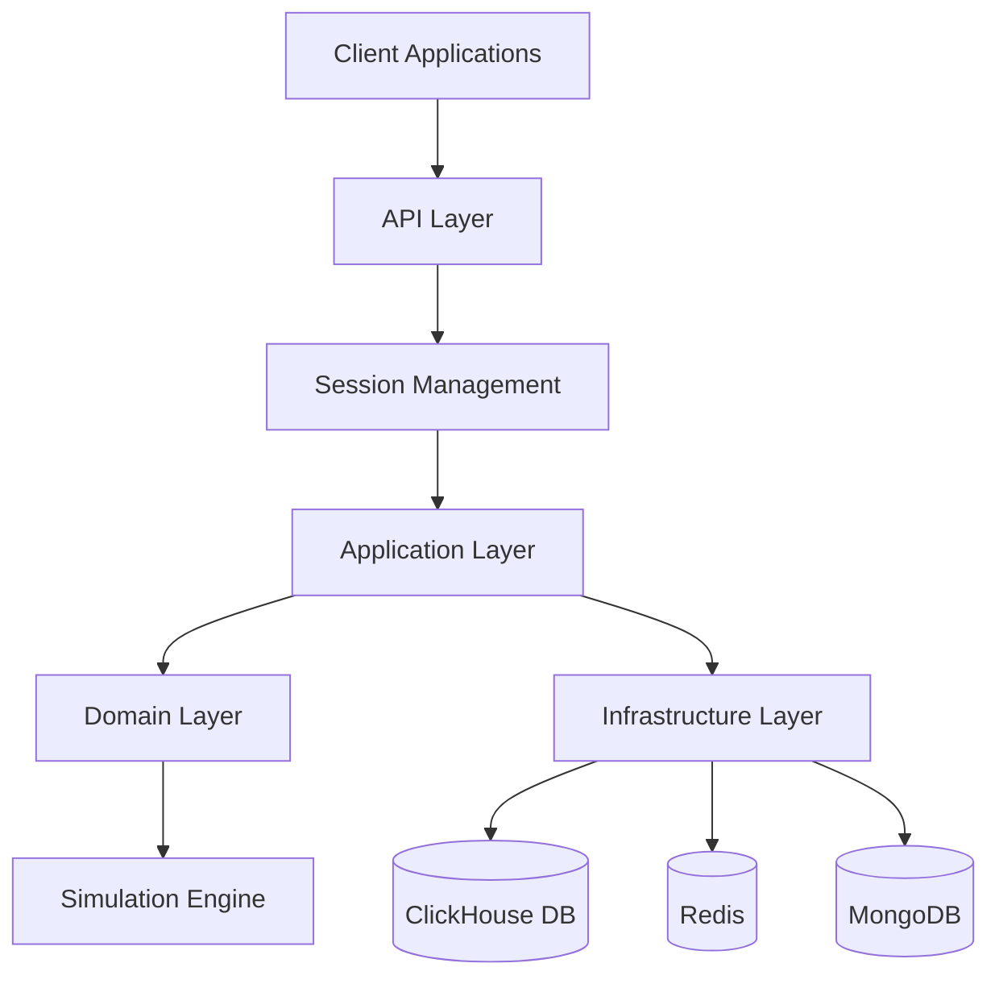
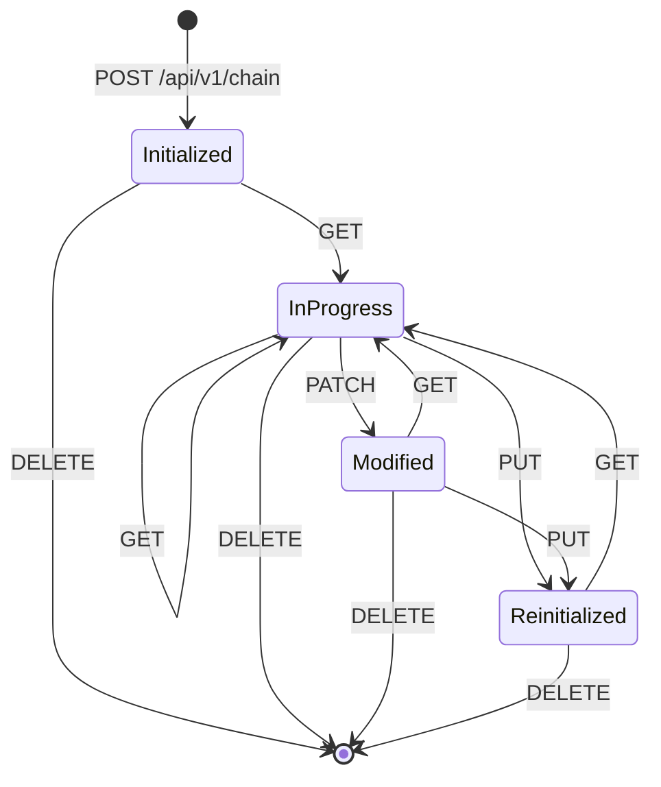
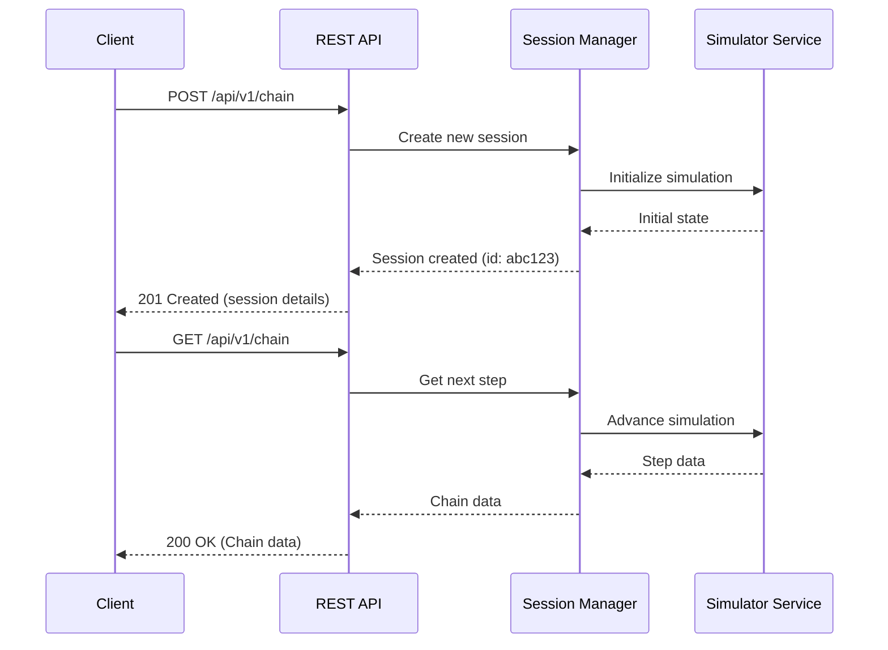
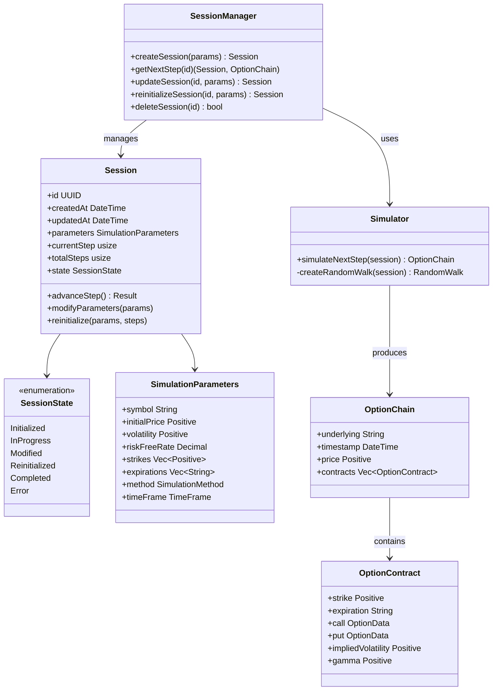
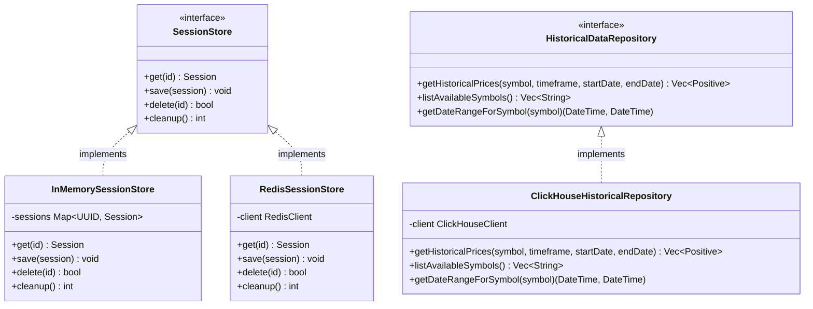

<div style="text-align: center;">

</div>

[](./LICENSE)
[](https://crates.io/crates/optionchain_simulator)
[](https://crates.io/crates/optionchain_simulator)
[](https://github.com/joaquinbejar/OptionChain-Simulator/stargazers)
[](https://github.com/joaquinbejar/OptionChain-Simulator/issues)
[](https://github.com/joaquinbejar/OptionChain-Simulator/pulls)
[](https://github.com/joaquinbejar/OptionChain-Simulator/actions)
[](https://codecov.io/gh/joaquinbejar/OptionChain-Simulator)
[](https://libraries.io/github/joaquinbejar/OptionChain-Simulator)
[](https://docs.rs/optionchain_simulator)


## OptionChain-Simulator API and Architecture

### System Architecture



### Session State Transitions



### API Request Flow



### REST API Endpoints

The OptionChain-Simulator exposes the following REST API endpoints:

| Method | Endpoint       | Action           | Description                                      |
|--------|---------------|------------------|--------------------------------------------------|
| POST   | /api/v1/chain | Create Session   | Creates a new simulation session                 |
| GET    | /api/v1/chain | Read Next Step   | Gets the next step in the simulation            |
| PUT    | /api/v1/chain | Replace Session  | Completely replaces session parameters          |
| PATCH  | /api/v1/chain | Update Parameters| Updates specific session parameters             |
| DELETE | /api/v1/chain | Delete Session   | Terminates and removes a session                 |

### Request/Response Models

#### 1. Create Session (POST /api/v1/chain)

**Request Body:**
```json
{
  "symbol": "AAPL",
  "steps": 10,
  "initial_price": 185.5,
  "days_to_expiration": 45.0,
  "volatility": 0.25,
  "risk_free_rate": 0.04,
  "dividend_yield": 0.005,
  "method": {
    "GeometricBrownian": {
      "dt": 0.004,
      "drift": 0.05,
      "volatility": 0.25
    }
  },
  "time_frame": "Day",
  "chain_size": 15,
  "strike_interval": 5.0,
  "smile_curve": 0.0005,
  "spread": 0.02
}
```

**Response (201 Created):**
```json
{
    "id": "6af613b6-569c-5c22-9c37-2ed93f31d3af",
    "created_at": "2025-04-21T15:37:30.518022+00:00",
    "updated_at": "2025-04-21T15:37:30.518022+00:00",
    "parameters": {
        "symbol": "AAPL",
        "initial_price": 185.5,
        "volatility": 0.25,
        "risk_free_rate": 0.04,
        "method": "GeometricBrownian { dt: 0.004, drift: 0.05, volatility: 0.25 }",
        "time_frame": "day",
        "dividend_yield": 0.005,
        "smile_curve": 0.0005,
        "spread": 0.02
    },
    "current_step": 0,
    "total_steps": 10,
    "state": "Initialized"
}
```

#### 2. Get Next Step (GET /api/v1/chain?sessionid=6af613b6-569c-5c22-9c37-2ed93f31d3af)

**Response (200 OK):**
```json
{
    "underlying": "AAPL",
    "timestamp": "2025-04-21T15:33:03.597061+00:00",
    "price": 185.299430466522,
    "contracts": [
        {
            "strike": 160.0,
            "expiration": "2025-06-05",
            "call": {
                "bid": 26.08,
                "ask": 26.1,
                "mid": 26.09,
                "delta": 0.9993778215543331
            },
            "put": {
                "bid": null,
                "ask": null,
                "mid": null,
                "delta": -4.2479708093406946e-6
            },
            "implied_volatility": 0.09731095458186256,
            "gamma": 3.121236702609213e-6
        },
        {
            "strike": 165.0,
            "expiration": "2025-06-05",
            "call": {
                "bid": 21.14,
                "ask": 21.16,
                "mid": 21.15,
                "delta": 0.9888998386575956
            },
            "put": {
                "bid": 0.03,
                "ask": 0.05,
                "mid": 0.04,
                "delta": -0.010482230867546823
            },
            "implied_volatility": 0.15077922021760087,
            "gamma": 0.0028266289100911603
        },
        {
            "strike": 170.0,
            "expiration": "2025-06-05",
            "call": {
                "bid": 16.62,
                "ask": 16.64,
                "mid": 16.63,
                "delta": 0.9153696474659715
            },
            "put": {
                "bid": 0.49,
                "ask": 0.51,
                "mid": 0.5,
                "delta": -0.08401242205917087
            },
            "implied_volatility": 0.1927733286389461,
            "gamma": 0.012279670056243013
        },
        {
            "strike": 175.0,
            "expiration": "2025-06-05",
            "call": {
                "bid": 12.87,
                "ask": 12.89,
                "mid": 12.88,
                "delta": 0.7964192920937592
            },
            "put": {
                "bid": 1.71,
                "ask": 1.73,
                "mid": 1.72,
                "delta": -0.2029627774313833
            },
            "implied_volatility": 0.22329327984589836,
            "gamma": 0.019409579420062936
        },
        {
            "strike": 180.0,
            "expiration": "2025-06-05",
            "call": {
                "bid": 9.76,
                "ask": 9.78,
                "mid": 9.77,
                "delta": 0.6700429413591044
            },
            "put": {
                "bid": 3.57,
                "ask": 3.59,
                "mid": 3.58,
                "delta": -0.3293391281660381
            },
            "implied_volatility": 0.24233907383845762,
            "gamma": 0.022910122989513254
        },
        {
            "strike": 185.0,
            "expiration": "2025-06-05",
            "call": {
                "bid": 7.09,
                "ask": 7.11,
                "mid": 7.1,
                "delta": 0.5468721177394451
            },
            "put": {
                "bid": 5.87,
                "ask": 5.89,
                "mid": 5.88,
                "delta": -0.45250995178569736
            },
            "implied_volatility": 0.24991071061662393,
            "gamma": 0.024315069945191076
        },
        {
            "strike": 190.0,
            "expiration": "2025-06-05",
            "call": {
                "bid": 4.68,
                "ask": 4.7,
                "mid": 4.69,
                "delta": 0.4237521134194814
            },
            "put": {
                "bid": 8.45,
                "ask": 8.47,
                "mid": 8.46,
                "delta": -0.5756299561056611
            },
            "implied_volatility": 0.24385078722742481,
            "gamma": 0.024638652336979393
        },
        {
            "strike": 195.0,
            "expiration": "2025-06-05",
            "call": {
                "bid": 2.62,
                "ask": 2.64,
                "mid": 2.63,
                "delta": 0.29452137751494756
            },
            "put": {
                "bid": 11.36,
                "ask": 11.38,
                "mid": 11.37,
                "delta": -0.7048606920101947
            },
            "implied_volatility": 0.22617927813392658,
            "gamma": 0.023389127623181388
        },
        {
            "strike": 200.0,
            "expiration": "2025-06-05",
            "call": {
                "bid": 1.03,
                "ask": 1.05,
                "mid": 1.04,
                "delta": 0.15952905609846607
            },
            "put": {
                "bid": 14.75,
                "ask": 14.77,
                "mid": 14.76,
                "delta": -0.8398530134266764
            },
            "implied_volatility": 0.19703361182603538,
            "gamma": 0.01891326128023662
        },
        {
            "strike": 205.0,
            "expiration": "2025-06-05",
            "call": {
                "bid": 0.16,
                "ask": 0.18,
                "mid": 0.17,
                "delta": 0.04271051015963935
            },
            "put": {
                "bid": 18.85,
                "ask": 18.87,
                "mid": 18.86,
                "delta": -0.9566715593655031
            },
            "implied_volatility": 0.15641378830375124,
            "gamma": 0.008916660747165772
        },
        {
            "strike": 210.0,
            "expiration": "2025-06-05",
            "call": {
                "bid": null,
                "ask": null,
                "mid": null,
                "delta": 0.0005597778266970925
            },
            "put": {
                "bid": 23.66,
                "ask": 23.68,
                "mid": 23.67,
                "delta": -0.9988222916984453
            },
            "implied_volatility": 0.10431980756707404,
            "gamma": 0.0002902662707065403
        }
    ],
    "session_info": {
        "id": "6af613b6-569c-5c22-9c37-2ed93f31d3af",
        "current_step": 1,
        "total_steps": 10
    }
}
```

#### 3. Update Session Parameters (PATCH /api/v1/chain?sessionid=6af613b6-569c-5c22-9c37-2ed93f31d3af)

**Request Body:**
```json
{
  "symbol": "AAPL",
   "initial_price": 385.5,
  "steps": 8,
  "volatility": 0.2,
  "risk_free_rate": 0.03,
  "dividend_yield": 0.005,
  "days_to_expiration": 30.0,
  "time_frame": "Day"
}
```

**Response (200 OK):**
```json
{
    "id": "6af613b6-569c-5c22-9c37-2ed93f31d3af",
    "created_at": "2025-04-21T15:32:59.551486+00:00",
    "updated_at": "2025-04-21T15:33:19.515911+00:00",
    "parameters": {
        "symbol": "AAPL",
        "initial_price": 385.5,
        "volatility": 0.2,
        "risk_free_rate": 0.03,
        "method": "GeometricBrownian { dt: 0.004, drift: 0.05, volatility: 0.25 }",
        "time_frame": "day",
        "dividend_yield": 0.005,
        "smile_curve": 0.0005,
        "spread": 0.02
    },
    "current_step": 0,
    "total_steps": 30,
    "state": "Reinitialized"
}
```

#### 4. Replace Session (PUT /api/v1/chain)

**Request Body:**
```json
{
  "symbol": "AAPL",
  "steps": 30,
  "initial_price": 385.5,
  "days_to_expiration": 45.0,
  "volatility": 0.25,
  "risk_free_rate": 0.04,
  "dividend_yield": 0.005,
  "method": {
    "GeometricBrownian": {
      "dt": 0.004,
      "drift": 0.05,
      "volatility": 0.25
    }
  },
  "time_frame": "Day",
  "chain_size": 15,
  "strike_interval": 5.0,
  "smile_curve": 0.0005,
  "spread": 0.02
}
```

**Response (200 OK):**
```json
{
    "id": "6af613b6-569c-5c22-9c37-2ed93f31d3af",
    "created_at": "2025-04-21T15:37:30.518022+00:00",
    "updated_at": "2025-04-21T15:37:33.951540+00:00",
    "parameters": {
        "symbol": "AAPL",
        "initial_price": 385.5,
        "volatility": 0.25,
        "risk_free_rate": 0.04,
        "method": "GeometricBrownian { dt: 0.004, drift: 0.05, volatility: 0.25 }",
        "time_frame": "day",
        "dividend_yield": 0.005,
        "smile_curve": 0.0005,
        "spread": 0.02
    },
    "current_step": 0,
    "total_steps": 30,
    "state": "Reinitialized"
}
```

#### 5. Delete Session (DELETE /api/v1/chain?sessionid=6af613b6-569c-5c22-9c37-2ed93f31d3af)

**Response (200 OK):**
```json
{
    "message": "Session deleted successfully: 6af613b6-569c-5c22-9c37-2ed93f31d3af",
    "session_id": "6af613b6-569c-5c22-9c37-2ed93f31d3af"
}
```

### Domain Models



### Infrastructure Components



#### 🚀 Deploy the project

To deploy the services defined in `Docker/docker-compose.yml`, run the following command:

```bash
make deploy
```

This will:
- Build the Docker images (`--build`)
- Force container recreation (`--force-recreate`)
- Run everything in detached mode (`-d`)
- Use `optionchain-simulator` as the project name to namespace containers and resources

Make sure Docker and Docker Compose are installed and running on your system.
### Makefile Commands for Development

The project includes a Makefile with useful commands for development:

| Command | Description |
|---------|-------------|
| `make build` | Builds the project |
| `make release` | Builds the project in release mode |
| `make test` | Runs all tests |
| `make fmt` | Formats the code using rustfmt |
| `make lint` | Runs clippy for linting |
| `make check` | Runs tests, formatting check, and linting |
| `make run` | Runs the project |
| `make clean` | Cleans build artifacts |
| `make doc` | Generates documentation |
| `make coverage` | Generates code coverage report |
| `make bench` | Runs benchmarks |
| `make deploy` | deploy the services in local |

Additional commands for CI/CD and deployment:

| Command | Description |
|---------|-------------|
| `make pre-push` | Runs fixes, formatting, linting, and tests before pushing |
| `make workflow` | Runs all GitHub Actions workflows locally |
| `make publish` | Publishes the package to crates.io |
| `make zip` | Creates a ZIP archive of the project |


## Contribution and Contact

We welcome contributions to this project! If you would like to contribute, please follow these steps:

1. Fork the repository.
2. Create a new branch for your feature or bug fix.
3. Make your changes and ensure that the project still builds and all tests pass.
4. Commit your changes and push your branch to your forked repository.
5. Submit a pull request to the main repository.

If you have any questions, issues, or would like to provide feedback, please feel free to contact the project maintainer:

**Joaquín Béjar García**
- Email: jb@taunais.com
- GitHub: [joaquinbejar](https://github.com/joaquinbejar)

We appreciate your interest and look forward to your contributions!

## ✍️ License

Licensed under MIT license
