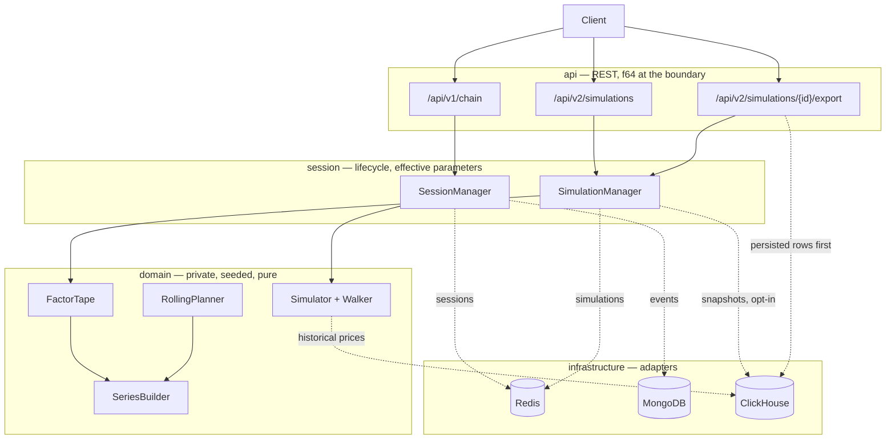
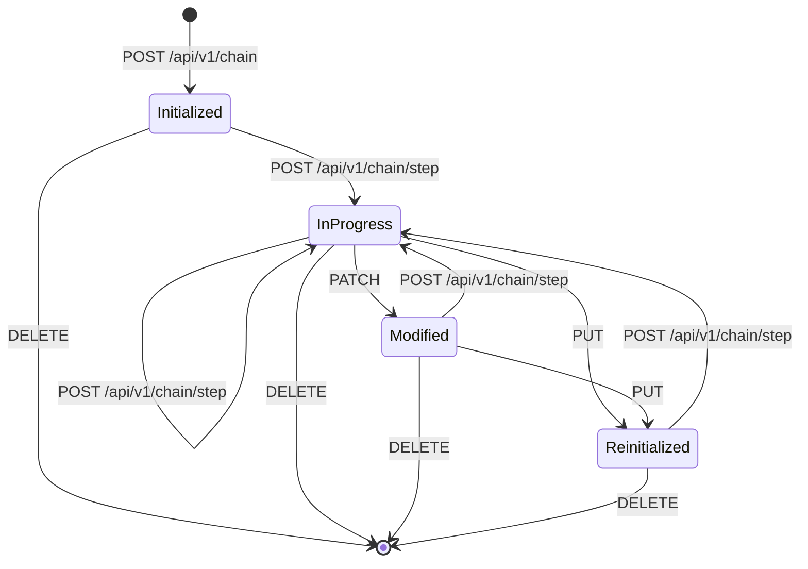
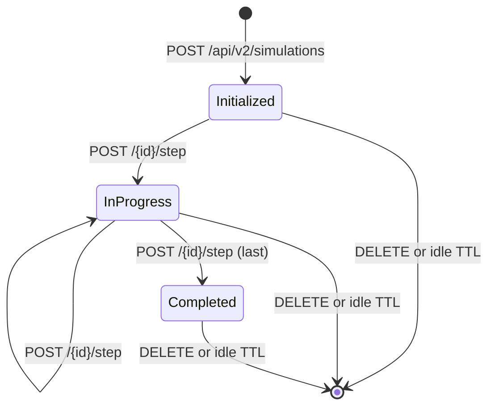
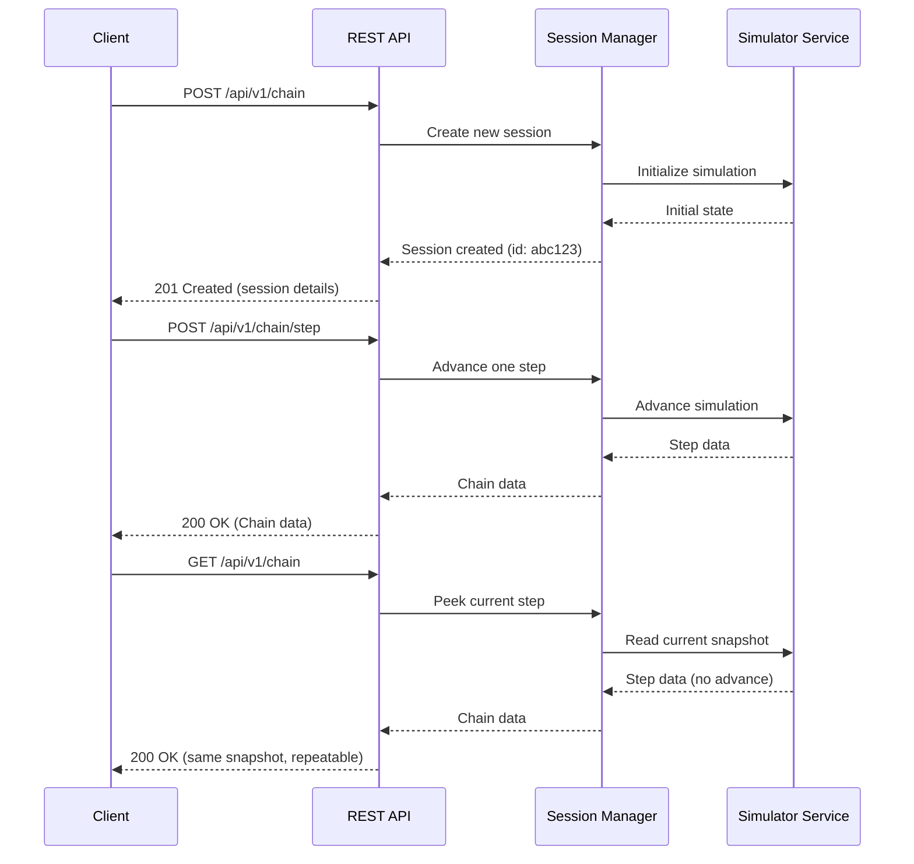
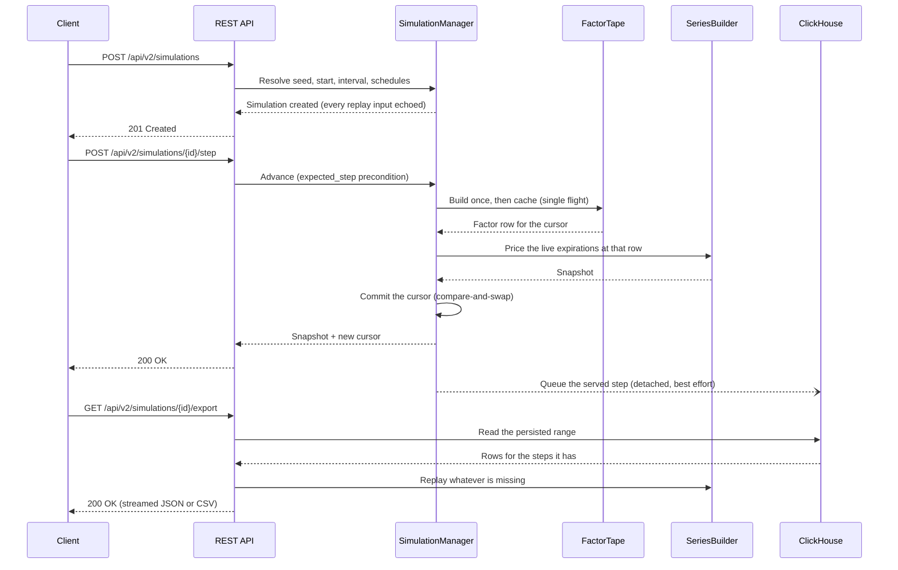
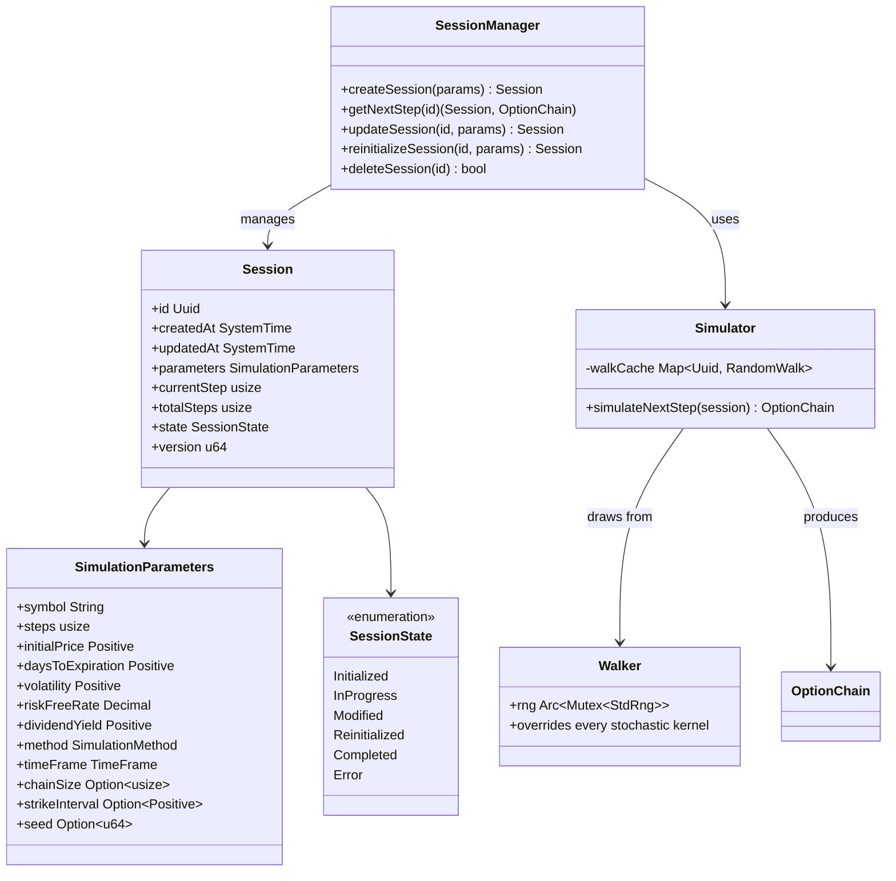
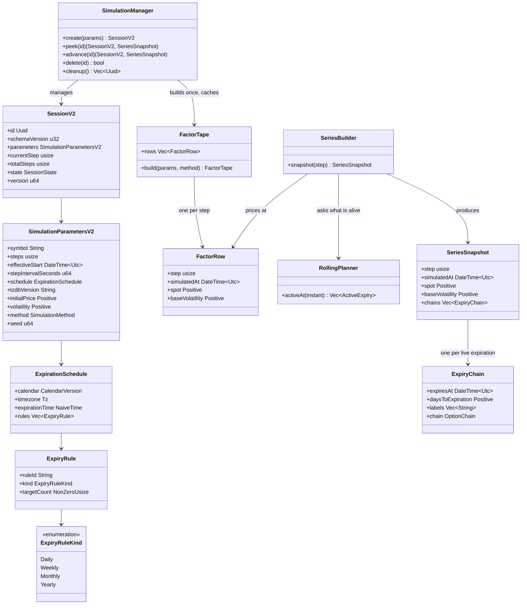
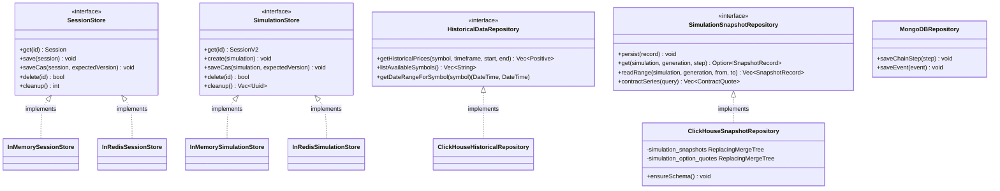

<div style="text-align: center;">

</div>

[](./LICENSE)
[](https://crates.io/crates/optionchain_simulator)
[](https://crates.io/crates/optionchain_simulator)
[](https://github.com/joaquinbejar/OptionChain-Simulator/stargazers)
[](https://github.com/joaquinbejar/OptionChain-Simulator/issues)
[](https://github.com/joaquinbejar/OptionChain-Simulator/pulls)
[](https://github.com/joaquinbejar/OptionChain-Simulator/actions)
[](https://codecov.io/gh/joaquinbejar/OptionChain-Simulator)
[](https://libraries.io/github/joaquinbejar/OptionChain-Simulator)
[](https://docs.rs/optionchain_simulator)


## OptionChain-Simulator API and Architecture

### System Architecture

Two REST surfaces over one set of layers. v1 serves a single expiration per
request and stamps it with the wall clock; v2 serves a rolling inventory of
absolute expirations on a simulated clock. They share the seeded walk and
the error boundary, and nothing else — separate session types, separate
stored schemas, separate stores.


```mermaid
flowchart TD
  Client[Client]

  subgraph api["api — REST, f64 at the boundary"]
    V1["/api/v1/chain"]
    V2["/api/v2/simulations"]
    Export["/api/v2/simulations/{id}/export"]
  end

  subgraph session["session — lifecycle, effective parameters"]
    SM[SessionManager]
    SIM[SimulationManager]
  end

  subgraph domain["domain — private, seeded, pure"]
    Simulator[Simulator + Walker]
    Tape[FactorTape]
    Planner[RollingPlanner]
    Series[SeriesBuilder]
  end

  subgraph infra["infrastructure — adapters"]
    Redis[(Redis)]
    Mongo[(MongoDB)]
    CH[(ClickHouse)]
  end

  Client --> V1 & V2 & Export
  V1 --> SM --> Simulator
  V2 --> SIM
  Export --> SIM
  SIM --> Tape
  Tape --> Series
  Planner --> Series
  SM -.sessions.-> Redis
  SIM -.simulations.-> Redis
  SM -.events.-> Mongo
  Simulator -.historical prices.-> CH
  SIM -.snapshots, opt-in.-> CH
  Export -.persisted rows first.-> CH
```

`domain` is a **private** module: the walk, the tape, the planner and the
snapshots are implementation, and the REST contract is what is public. The
dependency arrows only ever point down — an infrastructure adapter that
imported `api` would invert the layering, which is why the persistence layer
carries its own row types instead of naming the domain snapshot.

### Session State Transitions


```mermaid
stateDiagram-v2
[*] --> Initialized: POST /api/v1/chain
Initialized --> InProgress: POST /api/v1/chain/step
InProgress --> InProgress: POST /api/v1/chain/step
InProgress --> Modified: PATCH
Modified --> InProgress: POST /api/v1/chain/step
InProgress --> Reinitialized: PUT
Modified --> Reinitialized: PUT
Reinitialized --> InProgress: POST /api/v1/chain/step
Initialized --> [*]: DELETE
InProgress --> [*]: DELETE
Modified --> [*]: DELETE
Reinitialized --> [*]: DELETE
```

`GET /api/v1/chain` is a safe, repeatable peek and does not appear here because it
never changes the session state — only `POST /api/v1/chain/step` advances the cursor.

A v2 simulation walks a smaller machine, because it is immutable after
creation: there is no PATCH or PUT to reach `Modified` or `Reinitialized`,
and a stored document in either state is rejected on load rather than
served.


```mermaid
stateDiagram-v2
[*] --> Initialized: POST /api/v2/simulations
Initialized --> InProgress: POST /{id}/step
InProgress --> InProgress: POST /{id}/step
InProgress --> Completed: POST /{id}/step (last)
Initialized --> [*]: DELETE or idle TTL
InProgress --> [*]: DELETE or idle TTL
Completed --> [*]: DELETE or idle TTL
```

The state and the cursor are validated together: `Initialized` only at step
zero, `Completed` only at the horizon, `InProgress` strictly between them.
`GET /{id}/snapshot` and the export appear nowhere here — neither moves the
cursor, and the idle TTL is measured from the last write, so peeking does
not keep a simulation alive.

### API Request Flow


```mermaid
sequenceDiagram
participant Client
participant API as REST API
participant SM as Session Manager
participant SS as Simulator Service

Client->>API: POST /api/v1/chain
API->>SM: Create new session
SM->>SS: Initialize simulation
SS-->>SM: Initial state
SM-->>API: Session created (id: abc123)
API-->>Client: 201 Created (session details)

Client->>API: POST /api/v1/chain/step
API->>SM: Advance one step
SM->>SS: Advance simulation
SS-->>SM: Step data
SM-->>API: Chain data
API-->>Client: 200 OK (Chain data)

Client->>API: GET /api/v1/chain
API->>SM: Peek current step
SM->>SS: Read current snapshot
SS-->>SM: Step data (no advance)
SM-->>API: Chain data
API-->>Client: 200 OK (same snapshot, repeatable)
```

A v2 advance does more work behind the same shape. The tape is built on
first use rather than at creation, chains are priced per snapshot from a
factor row and the planner's live expirations, and — when persistence is on
— the served step is queued for the warehouse **after** the cursor commits,
so the write is never on the response's clock.


```mermaid
sequenceDiagram
participant Client
participant API as REST API
participant SIM as SimulationManager
participant Tape as FactorTape
participant Series as SeriesBuilder
participant CH as ClickHouse

Client->>API: POST /api/v2/simulations
API->>SIM: Resolve seed, start, interval, schedules
SIM-->>API: Simulation created (every replay input echoed)
API-->>Client: 201 Created

Client->>API: POST /api/v2/simulations/{id}/step
API->>SIM: Advance (expected_step precondition)
SIM->>Tape: Build once, then cache (single flight)
Tape-->>SIM: Factor row for the cursor
SIM->>Series: Price the live expirations at that row
Series-->>SIM: Snapshot
SIM->>SIM: Commit the cursor (compare-and-swap)
SIM-->>API: Snapshot + new cursor
API-->>Client: 200 OK
SIM--)CH: Queue the served step (detached, best effort)

Client->>API: GET /api/v2/simulations/{id}/export
API->>CH: Read the persisted range
CH-->>API: Rows for the steps it has
API->>Series: Replay whatever is missing
API-->>Client: 200 OK (streamed JSON or CSV)
```

### REST API Endpoints

The OptionChain-Simulator exposes the following REST API endpoints:

| Method | Endpoint           | Action              | Description                                                      |
|--------|--------------------|---------------------|------------------------------------------------------------------|
| POST   | /api/v1/chain      | Create Session      | Creates a new simulation session                                 |
| GET    | /api/v1/chain      | Read Current Step   | Returns the snapshot the next advance will serve (safe, repeatable)|
| POST   | /api/v1/chain/step | Advance Step        | Serves the snapshot at the cursor (index 0 first), then advances  |
| PUT    | /api/v1/chain      | Replace Session     | Completely replaces session parameters                           |
| PATCH  | /api/v1/chain      | Update Parameters   | Updates specific session parameters                              |
| DELETE | /api/v1/chain      | Delete Session      | Terminates and removes a session                                 |
| GET    | /health            | Liveness            | The process is alive; always 200, no dependency touched          |
| GET    | /ready             | Readiness           | 200 when every configured dependency answers, 503 naming those that did not |

#### Probes

The two answer different questions, and conflating them is how one outage
becomes two. `/health` says the process is alive: it touches nothing, so a
Redis hiccup can never get a healthy instance restarted. `/ready` says this
instance can take work, and it asks: Redis and MongoDB always, ClickHouse
when snapshot persistence is enabled, each under a 2-second bound and all of
them at once. A 503 body names every dependency and, for the failing ones, a
fixed category: `unreachable` or `timed_out`. Never a driver's own words —
the endpoint is unauthenticated, and a server message can carry internal
hosts, paths and tokens no redaction reliably recognises, so the full
explanation stays in the service's log. Nothing is cached, so an instance
whose Redis came back reports itself ready again without a restart.

Both are unversioned, unauthenticated, and excluded from the request
metrics: an orchestrator polling forever would otherwise add a constant to
every series and a flood of 503s to the error series while a dependency is
down. `Docker/docker-compose.yml` points its backend healthcheck at
`/ready`, so `docker compose up -d` reports the service healthy only once it
can actually serve.

**Step cursor semantics (serve-then-advance):** `current_step` is the 0-based index
of the NEXT snapshot to serve. `POST /api/v1/chain/step` serves the snapshot at the
cursor and then advances it, so a session with `steps = N` serves EXACTLY indices
`0..N-1` over `N` advances. The advance that serves the last snapshot persists the
`Completed` state, and any further advance returns `410 Gone`. `GET /api/v1/chain`
peeks the snapshot the next advance would serve without moving the cursor.

> **Migration (breaking, issue #21):** `GET /api/v1/chain` used to advance the
> session and consume a step. It is now a read-only, repeatable **peek** that returns
> the current snapshot without mutating state. To advance the cursor, clients must now
> call **`POST /api/v1/chain/step`** (same response shape, same 200/404/410/500 status
> codes as the old GET). Downstream consumers such as IronCondor must switch their
> step-advancing call from `GET /api/v1/chain` to `POST /api/v1/chain/step`.

### v2 rolling simulations

`/api/v2/simulations` is a second, parallel REST surface for deterministic
rolling multi-expiration simulations: a simulated clock instead of a
wall-clock timestamp, a rolling inventory of absolute expirations driven by
versioned schedule rules (0DTE / weekly / monthly / yearly), and one
snapshot per cursor position.

| Method | Endpoint | Action |
|--------|----------|--------|
| POST   | /api/v2/simulations              | Create a simulation and receive every replay input |
| GET    | /api/v2/simulations/{id}         | Read its metadata and effective parameters |
| GET    | /api/v2/simulations/{id}/snapshot| Peek the current snapshot (safe, repeatable) |
| POST   | /api/v2/simulations/{id}/step    | Serve the current snapshot, then advance once |
| DELETE | /api/v2/simulations/{id}         | Delete it and evict its cached state |

#### The bid-ask spread is per contract

A v2 chain used to be quoted with one spread applied to every contract,
which is not what an option market looks like: a dear in-the-money call and
a five-cent far wing do not carry the same absolute bid-ask, and the wing's
spread is a far larger fraction of its price. A consumer valuing a position
at the touch takes its whole cost of trading from that number.

The spread is now a small parametric model, evaluated per contract:

```
spread(contract) = max(
    spread_tick,
    spread
      + spread_proportional       * mid
      + spread_moneyness_widening * |ln(strike / underlying)|
      + spread_tenor_widening     * sqrt(days_to_expiration / 365)
)
```

Every coefficient is an optional create-request field, echoed back in the
simulation response so a run can be replayed, and every widening term
defaults to zero. A request that carries only the legacy `spread` therefore
quotes exactly as it did: the scalar IS the floor term, and the arithmetic
for every quote is unchanged.

**A quote is never withdrawn.** Upstream's `apply_spread` sets bid, ask AND
mid to `None` when `mid <= spread`, so the cheap wings vanished from the
chain exactly as they decayed — the moment a consumer most wants to know
what closing them costs. A contract that has a mid now always has a
two-sided quote, with the bid floored at `spread_tick` or at the mid,
whichever is lower: a contract worth less than a tick is quoted `0.00/0.01`
rather than being marked up to a penny it is not worth.

**Two things a legacy request sees change**, both consequences of that fix:

- **The chain is longer.** Upstream stopped extending the strike ladder at
  the first pair of strikes with no price, and that condition WAS the
  erasure. With nothing erased the ladder runs to the full
  `2 * chain_size + 1`: at spot 5000, 30 days and `chain_size = 30`, 45
  strikes become 61. Response payloads, export rows and warehouse rows grow
  with it, inside the same configured caps.
- **A spread below the tick is raised to it.** `spread: 0.005` now widens by
  half a cent each way rather than a quarter. At or above the tick — every
  request that took the documented default — the quotes are unchanged.

Persisted snapshots are therefore a new tape: `CURRENT_SNAPSHOT_GENERATION`
is `4`, so rows written by an older binary stay addressable under the
generation they were filed under and are never mixed with these. It moved
again with optionstratlib 0.21.1, which quotes an option worth nothing at
zero instead of pricing it as absent (OptionStratLib#487): upstream had
stopped extending a ladder at a strike whose worthless side carried no
price, so a chain near expiry held fewer strikes than `chain_size` asked
for — 23 instead of 41 at a spot of 5100 with a 25-point interval at 0.3125
days. That changes the strike set of those steps for rolling ladders as
much as for pinned ones.

#### The strike ladder can be pinned

The ladder is rebuilt around the current underlying at every step, so the
quoted strikes follow the spot and a contract quoted at step 0 can be gone
by step 2: a move of 0.27 percent over two steps was enough to drop a
strike. `chain_size` fixes how MANY strikes are quoted, never WHICH.

For a client browsing a chain that is right. For one holding a position it
is not: a leg opened at 4850 cannot be marked, closed or settled at a step
where 4850 does not exist, and a defined-risk structure loses its furthest
wings first, which are the legs that cap its risk.

`strike_ladder` on the v2 create request chooses:

| Value | Meaning |
|-------|---------|
| `rolling` | The default, and what the service always did. The ladder follows the spot, so the quoted strikes stay near the money and a contract can leave the chain. |
| `pinned` | The ladder is fixed at creation from `initial_price`, `chain_size` and `strike_interval`. Every step quotes that same set, so a contract quoted once is quoted for the simulation's whole life. |

A pinned simulation must supply `strike_interval`: without one the interval
is derived per expiration and there is no fixed grid to pin, so the request
is a `400` naming the field. The effective value is echoed in the simulation
response and survives a store round trip, and a document written before the
field reads as `rolling`.

**A pinned ladder does not follow a large move.** If the spot leaves the
pinned range every quoted strike ends up on one side of the money — each
contract still carries both a call and a put, but they are all deep in or
deep out. That is correct and informative: a simulation that silently
invented new strikes would not be the closed world the setting exists to
provide. Widen the ladder at creation, with `chain_size`, rather than at
step time. A spot that drifts further than the service will widen for is a
`400` naming `strike_ladder` rather than a silently shorter chain.

`/api/v1/chain` is untouched, model and all: it is frozen, and its chains
come from a different upstream path.

**Serve-then-advance**, as in v1: a simulation with `steps = N` serves
indices `0..N-1` over `N` calls to `/step`, and any call after that returns
`410 Gone`. `expected_step` on the advance is a precondition — a mismatch is
`412` with the actual cursor and consumes nothing, which is what makes a
retry after a lost response safe. It is deliberately distinct from `409`,
which means another writer committed first.

**A v2 simulation is immutable after creation.** There is no PATCH or PUT:
changing the seed, the start, the schedules or the chain shape changes the
tape, so it creates a new simulation instead of mutating one.

**A historical v2 walk prices itself.** A `Historical` method carries no
volatility of its own, so each step is priced by the realized volatility of
everything observed up to that step and nothing later — the same expanding
window v1 uses, so from step 1 on the two agree on the volatility path as
well as the price path. (Step 0 differs by construction: v1 prices its first
chain at the request's constant.) The `volatility` you send prices none of
its steps; the values that did are the per-step ones every snapshot and the
`volatility` export report. A series too turbulent to price a chain at, or
one whose first three prices are equal, is refused when the simulation is
first served.

**Advanced steps can be filed in ClickHouse.** With
`OCS_SNAPSHOT_PERSISTENCE_ENABLED` on, every step an advance serves is
written as one metadata row plus one flattened row per expiration and
strike, so a client can query one contract across time instead of unwinding
whole documents. A peek and an export replay and persist nothing — only the
advance, which is the call that moves the cursor, files anything.

Filing happens **after** the cursor commits and off the request's clock, so
a degraded warehouse can neither fail a response nor delay one. Row identity
is derived from `(simulation, tape generation, step)`, which makes a retry
replace a row rather than duplicate it, and a reader never sees a snapshot
whose quote rows are missing — the metadata row carries the expected count
and a mismatch reads as absent. Turning the knob on makes ClickHouse a hard
startup dependency: the tables are created at boot, so a schema or
connectivity problem fails the boot rather than surfacing later. MongoDB
stays event and audit only.

**Replay.** The creation response echoes the effective seed, effective
start, step interval, time frame, timezone, calendar version, IANA tzdb
release and normalised schedules — everything needed to reproduce the run
without having kept the request. The full contract is in
[ADR 0001](https://github.com/joaquinbejar/OptionChain-Simulator/blob/main/doc/adr/0001-v2-rolling-simulation-contract.md).

**`/api/v1/chain` is frozen.** Its routes, DTO fields and types, wall-clock
`timestamp` behaviour, rendered values, status codes and OpenAPI operations
are byte- and behaviour-compatible; v2 ships as a separate surface with its
own session type and its own stored-session schema, so existing clients
need no changes.

### Configuration

`LOGLEVEL` sets the verbosity, case-insensitively, defaulting to `INFO`. An
unrecognised value warns once and falls back rather than aborting startup,
and the effective level is logged at that same level, so setting `WARN` or
`ERROR` still confirms itself.
`DEBUG` includes hyper connection traces on every request, which a batch
consumer will want to avoid.

**A blank value is an unset value.** `KNOB=` and `KNOB="   "` are read
exactly as if the line were absent, and the documented default applies, so a
knob is switched off by commenting it out rather than by emptying it.

One variable is exempt: `CLICKHOUSE_PASSWORD`, where an empty value is a
real configuration — a stock `default` user has no password — so a present
variable is taken as written and only an absent one falls back. Values are
never trimmed either: whitespace decides only whether a value is blank, and
a credential written with a leading space keeps it. Numbers and host names
are trimmed where they are parsed.

Every environment variable the service reads is documented in
`.env.example` with its default and accepted range. Two families, with
deliberately different failure behaviour:

- **Request caps** — `OCS_MAX_STEPS`, `OCS_MAX_CHAIN_SIZE`,
  `OCS_MAX_HISTORICAL_PRICES`, `OCS_MAX_CONCURRENT_PRICING_JOBS`,
  `OCS_MAX_CACHED_WALKS`, `OCS_EXPORT_BLOCK_ROWS` — warn and fall back
  to their defaults when set to something invalid. A bad value there
  degrades one request.
- **v2 operational knobs** — `OCS_V2_RETENTION_SECS`,
  `OCS_V2_CLEANUP_INTERVAL_SECS`, `OCS_MAX_CACHED_TAPES`,
  `OCS_MAX_CACHED_SNAPSHOTS`, `OCS_MAX_SNAPSHOT_CONTRACTS`,
  `OCS_MAX_CACHED_SNAPSHOT_CONTRACTS`, `OCS_MAX_EXPORT_ROWS`,
  `OCS_SNAPSHOT_*` — are **validated at startup** and fail the process with
  a message naming the variable. Silently reverting a
  retention window would expire simulations a client is still walking, and
  silently reverting a cache bound would change the service's memory
  profile with nothing to show for it.

**Where the server listens** — `OCS_BIND_ADDRESS` (an IP address, or the
words `all` and `localhost`) and `OCS_PORT` (`1..=65535`) — is configurable
and validated at startup like the second family: two instances quietly
fighting over one port is worse than a refusal. The address now defaults to
**loopback**, where it used to be a hardcoded `0.0.0.0`; this service has no
authentication and no rate limiting, so reachability off the host is a
decision. A deployment that relied on the old default must set
`OCS_BIND_ADDRESS=0.0.0.0` — `Docker/docker-compose.yml` sets it and the dev
override inherits it. Configuring
the port is what makes it possible to shard tape materialisation across
several instances on one host, which is embarrassingly parallel work: each
simulation is independent and shares no state.

**v2 retention is real time, not simulated time.** A simulation whose
simulated clock spans three years is still walked one request at a time, so
its idle window is an operational choice independent of the horizon. It
defaults to an hour — longer than v1's thirty minutes — and is measured from
the last **write**: peeking a snapshot persists nothing, so a client that
only peeks does not refresh it. The in-memory and Redis backends apply the
same window from the same constant.

A retention sweep runs every `OCS_V2_CLEANUP_INTERVAL_SECS`, reaping expired
simulations and evicting the factor tapes and snapshots they left behind.
Eviction is never observable in what is served: both rebuild identically
from the effective parameters, so it costs latency and nothing else. The
sweep publishes `v2_simulations_expired_total`, and the caches publish
`v2_tape_cache_size` and `v2_snapshot_cache_size`.

### Testing against a deployment

The default suite is hermetic: `LOGLEVEL=WARN cargo test --workspace`
passes with no Redis, no MongoDB and no ClickHouse running, and opens no
socket. It covers the code, and not the thing an operator runs: a service
on a port, behind a container, with those three behind it.

`examples/integration` covers that. It talks to the service named by
`OCS_INTEGRATION_BASE_URL` over HTTP, scheme and port included, and every
test in it SKIPS when the variable is unset or blank, which is why it can
live in the workspace without costing the hermetic suite anything. Run it
with `make test-integration`.

Two things follow from testing a DEPLOYMENT rather than a build. A deployed
service can be older than the working tree, so the suite reports the
version it found and skips a feature that is not deployed yet rather than
failing it. And it is shared, so every test deletes the simulations it
creates, including when it fails.

### Exporting a tape

`GET /api/v2/simulations/{id}/export?dataset=…&format=…&from_step=&to_step=`
streams a simulation's tape, which is what turns a
walked-one-request-at-a-time simulation into something a backtester loads in
one go. With persistence on it reads the steps the warehouse already holds,
in windows, and replays the rest; with it off, or for a simulation nobody
has walked, every step is replayed. Either source renders the same bytes.

| Parameter | Values |
|-----------|--------|
| `dataset` | `underlying` \| `volatility` \| `option_chains` |
| `format`  | `json` \| `csv` \| `arrow` \| `packed` |
| `from_step`, `to_step` | inclusive bounds; default to the whole tape |
| `greeks` | `none` (default) \| `first` \| `all` — `option_chains` only |

**Read-only in the strong sense.** The export works from an immutable copy
of the effective parameters and, where it reads them, from rows already
written: it never advances the cursor, changes the state or version, writes
a snapshot of its own, or alters what the next peek returns.
A simulation that has never been walked exports its whole tape, a completed
one still does, and two clients can export the same simulation at once.

**The greek columns are opt-in and append-only.** `greeks` takes the same
three values, with the same meaning and the same default, as the chain
endpoints, so a tape and a live step agree on what a level means. `first`
appends `call_theta`, `put_theta`, `call_vega`, `put_vega`, `call_rho`,
`put_rho`, `call_rho_d`, `put_rho_d`; `all` appends fourteen more, `gamma`
through `color`, per style. `delta` is not among them — it already has its
`call_delta` / `put_delta` columns, and a second copy could only drift.

Each level's header is a **prefix** of the next, so raising the level
appends columns and never moves one: a consumer parsing by position keeps
working, and the default export is byte-identical to what it was before the
parameter existed. The column set is fixed per level, so a strike with no
computable greeks writes empty fields rather than fewer of them.

Measured on a 5 996-row export, release build:

| Level | CSV | JSON | Wall time |
|-------|-----|------|-----------|
| `none` | 1.27 MB | 2.54 MB | 303 ms |
| `first` | 2.23 MB | 4.06 MB | 459 ms |
| `all` | 4.01 MB | 6.87 MB | 469 ms |

`first` and `all` cost the same to compute — upstream builds the snapshot
whole and the level only decides what is written — so the step from `first`
to `all` is paid in bytes, not in time.

#### The binary encodings

`json` and `csv` are text, so every consumer pays a parse, and for the two
that matter that parse IS the bottleneck: a browser materialising a whole
tape spends hundreds of milliseconds in `JSON.parse` and allocates an object
per row, and a Rust consumer writing Parquet re-parses text this service
already held in typed form.

- **`arrow`** — an Arrow IPC **stream**, one record batch per block.
  `Content-Type: application/vnd.apache.arrow.stream`, extension `arrow`.
  Available only when the service is built with the **`arrow-export`**
  feature, which is off by default because the `arrow` crate is a large tree
  and a deployment that never exports should not carry it. Asking for
  `format=arrow` without it is a typed `400` naming the format, never a 500
  and never a silent fallback.
- **`packed`** — a dependency-free columnar block format for the browser.
  `Content-Type: application/octet-stream`, extension `ocsp`.

Both carry the **same column names in the same order as the CSV header**, so
a reader moves between encodings without a mapping table, and both are
`f64` for every numeric column — exactly what `json` and `csv` render.
Binary is a faster route to the same numbers, NOT a route to the underlying
`Decimal(38, 28)` precision.

**Both stream, in blocks.** A columnar encoding cannot emit a column until
its last row is known, so rows are buffered `OCS_EXPORT_BLOCK_ROWS` at a
time (default 4096) and written a block at a time. An export's memory is
therefore a function of the block width and not of the number of steps.

The `packed` layout, little-endian throughout:

```
file        := header block* footer
header      := "OCSP" u32:version u32:block_rows
               u32:dictionary_count dictionary_entry*
               u32:column_count column_desc*
               pad to 8
dict_entry  := u32:len utf8:value             (the symbol, then the rule ids)
column_desc := u32:name_len utf8:name u8:type_code u8:nullable pad to 4
block       := u32:row_count pad to 8 column_payload*
payload     := [validity bitmap if nullable, padded to 8] values, padded to 8
footer      := u32:0xFFFFFFFF pad to 8 u64:total_rows
```

**The footer is required, and a decoder must check it.** No block can carry
`0xFFFFFFFF` rows, so that value is what says the blocks have ended, and the
`u64` after it is the total the writer emitted. A document that ends without
it was truncated and must be REJECTED rather than read as a shorter tape:
the response is a 200 whose header goes out before the first byte is
produced, so a dropped connection is otherwise indistinguishable from a
smaller export. A total that disagrees with the blocks is the same error.

Type codes: `0` = `f64`, `1` = `i64`, `2` = timestamp in nanoseconds since
the epoch, `3` = an index into the header dictionary, `4` = a **label
bitmask**, one bit per dictionary entry. Every payload starts on an 8-byte
boundary, which is the whole point: it is what lets a browser do
`new Float64Array(buffer, offset, count)` with no copy, and an unaligned
offset would make that constructor throw. Validity bitmaps follow Arrow's
convention — LSB-first, `1` = valid — so one decoder serves both formats,
and a null is a cleared bit rather than a sentinel or a NaN, which are
values a chain can legitimately hold.

Keeping the text columns out of the blocks is what the dictionary is for:
the symbol is fixed for a simulation and the schedule's rule ids are fixed
by its parameters, so both are known before the first row. `labels` is a
bitmask over those rule ids, and joining the bits it sets reproduces the
`csv` column character for character, since both orders are lexicographic.
A simulation is capped at 16 schedule rules at creation, well inside the 63
a mask carries, and a compile-time assertion keeps the two from drifting
apart.

Measured on the reference fixture at `greeks=all`, release build:

| Format | Bytes | Wall time |
|--------|-------|-----------|
| `json` | 79 888 | 9.7 ms |
| `csv` | 46 819 | 7.8 ms |
| `arrow` | 29 640 | 6.5 ms |
| `packed` | 22 808 | 6.1 ms |

**Deterministic.** Repeating an export is byte-identical: every value is a
function of the effective parameters and the cursor, timestamps render as
whole-second RFC 3339, and numbers use shortest round-trip formatting with
no locale. JSON is a single valid array; CSV is RFC 4180 with a header row
and CRLF endings, and an absent optional is an **empty** field rather than
`null` or `0`. Chain labels are joined with `|` so a shared expiration stays
one column.

The two encodings carry the same *values*, though not always the same
notation. JSON writes `4950.0` where the CSV writes `4950`, so every
integral value differs, on every row; and JSON takes exponent form below
`1e-5` — a `color` of `6.4101559520200445e-6` — where the CSV spells the
zeros out. Compare the two as numbers, never as text. JSON key order is not
part of the contract; parse by name.

**The greeks are `f64` here**, where the chain endpoints carry them as exact
decimal strings. A CSV column has no type to make that distinction, and this
surface's contract is that two runs compare byte for byte. So a tape and a
live step agree on which greeks a level carries and on what they mean — but
reconcile their numbers by value, not by string.

`gamma` appears three times at `all`: the shared `gamma` column plus
`call_gamma` / `put_gamma`. They agree for a European option. The shared one
is upstream's convenience mirror and stays defined at expiry and at zero
volatility, where the per-style pair goes blank — which is the case where
diffing them is informative rather than a bug.

The rows are produced on a blocking thread and handed over a bounded
channel, so a long `option_chains` export never occupies an Actix worker and
a slow client applies backpressure instead of accumulating priced chains in
memory. `OCS_MAX_EXPORT_ROWS` bounds how many steps one request may cover.

### Request/Response Models

#### 1. Create Session (POST /api/v1/chain)

**Request Body:**
```json
{
  "symbol": "AAPL",
  "steps": 10,
  "initial_price": 185.5,
  "days_to_expiration": 45.0,
  "volatility": 0.25,
  "risk_free_rate": 0.04,
  "dividend_yield": 0.005,
  "method": {
    "GeometricBrownian": {
      "dt": 0.004,
      "drift": 0.05,
      "volatility": 0.25
    }
  },
  "time_frame": "Day",
  "chain_size": 15,
  "strike_interval": 5.0,
  "smile_curve": 0.0005,
  "spread": 0.02
}
```

**Response (201 Created):**
```json
{
    "id": "6af613b6-569c-5c22-9c37-2ed93f31d3af",
    "created_at": "2025-04-21T15:37:30.518022+00:00",
    "updated_at": "2025-04-21T15:37:30.518022+00:00",
    "parameters": {
        "symbol": "AAPL",
        "initial_price": 185.5,
        "volatility": 0.25,
        "risk_free_rate": 0.04,
        "method": "GeometricBrownian { dt: 0.004, drift: 0.05, volatility: 0.25 }",
        "time_frame": "day",
        "dividend_yield": 0.005,
        "smile_curve": 0.0005,
        "spread": 0.02,
        "seed": 13748925402398765431
    },
    "current_step": 0,
    "total_steps": 10,
    "state": "Initialized"
}
```

The request omitted `seed`, so one was generated at conversion and echoed
here. Recording it is what lets the same session be recreated later: the
same parameters and the same seed reproduce the identical sequence of
snapshots, which is the guarantee IronCondor's replay depends on.

#### 2. Peek Current Step (GET /api/v1/chain?sessionid=6af613b6-569c-5c22-9c37-2ed93f31d3af)

Safe and repeatable: returns the session's current snapshot without advancing the
cursor or persisting anything. To advance the session and consume a step, use
`POST /api/v1/chain/step?sessionid=...` (issue #21) — it takes the same query
parameter and returns the same body shown below.

**Response (200 OK):**
```json
{
    "underlying": "AAPL",
    "timestamp": "2025-04-21T15:33:03.597061+00:00",
    "price": 185.299430466522,
    "contracts": [
        {
            "strike": 160.0,
            "expiration": "2025-06-05",
            "call": {
                "bid": 26.08,
                "ask": 26.1,
                "mid": 26.09,
                "delta": 0.9993778215543331
            },
            "put": {
                "bid": null,
                "ask": null,
                "mid": null,
                "delta": -4.2479708093406946e-6
            },
            "implied_volatility": 0.09731095458186256,
            "gamma": 3.121236702609213e-6
        },
        {
            "strike": 165.0,
            "expiration": "2025-06-05",
            "call": {
                "bid": 21.14,
                "ask": 21.16,
                "mid": 21.15,
                "delta": 0.9888998386575956
            },
            "put": {
                "bid": 0.03,
                "ask": 0.05,
                "mid": 0.04,
                "delta": -0.010482230867546823
            },
            "implied_volatility": 0.15077922021760087,
            "gamma": 0.0028266289100911603
        },
        {
            "strike": 170.0,
            "expiration": "2025-06-05",
            "call": {
                "bid": 16.62,
                "ask": 16.64,
                "mid": 16.63,
                "delta": 0.9153696474659715
            },
            "put": {
                "bid": 0.49,
                "ask": 0.51,
                "mid": 0.5,
                "delta": -0.08401242205917087
            },
            "implied_volatility": 0.1927733286389461,
            "gamma": 0.012279670056243013
        },
        {
            "strike": 175.0,
            "expiration": "2025-06-05",
            "call": {
                "bid": 12.87,
                "ask": 12.89,
                "mid": 12.88,
                "delta": 0.7964192920937592
            },
            "put": {
                "bid": 1.71,
                "ask": 1.73,
                "mid": 1.72,
                "delta": -0.2029627774313833
            },
            "implied_volatility": 0.22329327984589836,
            "gamma": 0.019409579420062936
        },
        {
            "strike": 180.0,
            "expiration": "2025-06-05",
            "call": {
                "bid": 9.76,
                "ask": 9.78,
                "mid": 9.77,
                "delta": 0.6700429413591044
            },
            "put": {
                "bid": 3.57,
                "ask": 3.59,
                "mid": 3.58,
                "delta": -0.3293391281660381
            },
            "implied_volatility": 0.24233907383845762,
            "gamma": 0.022910122989513254
        },
        {
            "strike": 185.0,
            "expiration": "2025-06-05",
            "call": {
                "bid": 7.09,
                "ask": 7.11,
                "mid": 7.1,
                "delta": 0.5468721177394451
            },
            "put": {
                "bid": 5.87,
                "ask": 5.89,
                "mid": 5.88,
                "delta": -0.45250995178569736
            },
            "implied_volatility": 0.24991071061662393,
            "gamma": 0.024315069945191076
        },
        {
            "strike": 190.0,
            "expiration": "2025-06-05",
            "call": {
                "bid": 4.68,
                "ask": 4.7,
                "mid": 4.69,
                "delta": 0.4237521134194814
            },
            "put": {
                "bid": 8.45,
                "ask": 8.47,
                "mid": 8.46,
                "delta": -0.5756299561056611
            },
            "implied_volatility": 0.24385078722742481,
            "gamma": 0.024638652336979393
        },
        {
            "strike": 195.0,
            "expiration": "2025-06-05",
            "call": {
                "bid": 2.62,
                "ask": 2.64,
                "mid": 2.63,
                "delta": 0.29452137751494756
            },
            "put": {
                "bid": 11.36,
                "ask": 11.38,
                "mid": 11.37,
                "delta": -0.7048606920101947
            },
            "implied_volatility": 0.22617927813392658,
            "gamma": 0.023389127623181388
        },
        {
            "strike": 200.0,
            "expiration": "2025-06-05",
            "call": {
                "bid": 1.03,
                "ask": 1.05,
                "mid": 1.04,
                "delta": 0.15952905609846607
            },
            "put": {
                "bid": 14.75,
                "ask": 14.77,
                "mid": 14.76,
                "delta": -0.8398530134266764
            },
            "implied_volatility": 0.19703361182603538,
            "gamma": 0.01891326128023662
        },
        {
            "strike": 205.0,
            "expiration": "2025-06-05",
            "call": {
                "bid": 0.16,
                "ask": 0.18,
                "mid": 0.17,
                "delta": 0.04271051015963935
            },
            "put": {
                "bid": 18.85,
                "ask": 18.87,
                "mid": 18.86,
                "delta": -0.9566715593655031
            },
            "implied_volatility": 0.15641378830375124,
            "gamma": 0.008916660747165772
        },
        {
            "strike": 210.0,
            "expiration": "2025-06-05",
            "call": {
                "bid": null,
                "ask": null,
                "mid": null,
                "delta": 0.0005597778266970925
            },
            "put": {
                "bid": 23.66,
                "ask": 23.68,
                "mid": 23.67,
                "delta": -0.9988222916984453
            },
            "implied_volatility": 0.10431980756707404,
            "gamma": 0.0002902662707065403
        }
    ],
    "session_info": {
        "id": "6af613b6-569c-5c22-9c37-2ed93f31d3af",
        "current_step": 1,
        "total_steps": 10
    }
}
```

##### The `greeks` query parameter

Both chain-serving endpoints on each version — `GET /api/v1/chain`,
`POST /api/v1/chain/step`, `GET /api/v2/simulations/{id}/snapshot` and
`POST /api/v2/simulations/{id}/step` — accept an optional `greeks` level.
It is opt-in, and its default is the response shown above: the full set is
twelve values per option style, and a chain can be a thousand strikes wide
across many expirations, so a play-loop client that does not need them must
not be made to download them.

| `greeks` | The `greeks` key on each quoted side |
|----------|--------------------------------------|
| absent, or `none` | Not present at all. `implied_volatility`, `gamma` and the per-side `delta` as before |
| `first` | `theta`, `vega`, `rho`, `rho_d` |
| `all` | The full twelve-value snapshot: `delta`, `gamma`, `theta`, `vega`, `rho`, `rho_d`, `alpha`, `vanna`, `vomma`, `veta`, `charm`, `color` |

Any other value is a `400` naming `greeks`, never a silent fall back to the
default: a client that asked for `all` and quietly received nothing would
price a position against greeks it never got.

One quoted side at `greeks=all`: the 105 strike of a chain built on a 100
underlying, 30 days to expiration, a 4% rate and a 1.5% dividend yield, with
a base volatility of 20% that the skew and smile shape to 0.1983 at this
strike:

```json
"call": {
    "bid": 0.66,
    "ask": 0.68,
    "mid": 0.67164031192058,
    "delta": 0.21342098496717668,
    "greeks": {
        "delta": 0.21342098496717668,
        "gamma": 0.051153162287244945,
        "theta": -0.028939075152022566,
        "vega": 0.0833669467282696,
        "rho": 0.016989417686134593,
        "rho_d": -0.01754145081922,
        "alpha": -1.7676156552525426,
        "vanna": 1.2473442995808184,
        "vomma": 0.28383006074363937,
        "veta": 0.00003481610090995518,
        "charm": -0.0044637844401925674,
        "color": -0.00023019242252391244
    }
}
```

The put of the same strike carries `"rho": -0.06902868754146463` and
`"charm": -0.004504829695657003`: the sign flips on `rho` and the value
differs on `charm`, so the two sides are genuinely computed rather than one
copied twice. `gamma`, `vega`, `vanna`, `vomma`, `veta` and `color` are
style-independent and do agree. `alpha` differs too — it is a ratio, and the
two sides have different thetas.

Three things a client has to know about those numbers:

- **Every value is per ONE LONG CONTRACT.** The client applies position
  sign and size, exactly once. Upstream builds the snapshot as a long
  position and applies the side sign inside every greek, so a consumer that
  applies it again double-counts.
- **They are `f64`, like every other number on this surface.** The DTOs are
  this crate's own twelve- and four-field types, converted from upstream's
  `Decimal` exactly once at the boundary, so upstream's serialisation never
  becomes part of this service's contract by accident.
- **`null` means not meaningful for these inputs**, never zero. Only `rho`,
  `rho_d` and `alpha` can be null. Distinct from that: a strike whose option
  cannot be built carries **no `greeks` key at all**, which on the wire looks
  like the default level. Its `implied_volatility`, `gamma` and `delta` are
  still there — they are defined where the full set is not.

`delta` and `gamma` keep their existing places on the quote and the
contract. They are computed independently of the snapshot and stay defined
at expiry and at zero volatility, where the full set is not, so the default
response is unchanged at every strike — degenerate ones included.

#### 3. Update Session Parameters (PATCH /api/v1/chain?sessionid=6af613b6-569c-5c22-9c37-2ed93f31d3af)

**Request Body:**
```json
{
  "symbol": "AAPL",
   "initial_price": 385.5,
  "steps": 8,
  "volatility": 0.2,
  "risk_free_rate": 0.03,
  "dividend_yield": 0.005,
  "days_to_expiration": 30.0,
  "time_frame": "Day"
}
```

**Response (200 OK):**
```json
{
    "id": "6af613b6-569c-5c22-9c37-2ed93f31d3af",
    "created_at": "2025-04-21T15:32:59.551486+00:00",
    "updated_at": "2025-04-21T15:33:19.515911+00:00",
    "parameters": {
        "symbol": "AAPL",
        "initial_price": 385.5,
        "volatility": 0.2,
        "risk_free_rate": 0.03,
        "method": "GeometricBrownian { dt: 0.004, drift: 0.05, volatility: 0.25 }",
        "time_frame": "day",
        "dividend_yield": 0.005,
        "smile_curve": 0.0005,
        "spread": 0.02
    },
    "current_step": 0,
    "total_steps": 30,
    "state": "Reinitialized"
}
```

#### 4. Replace Session (PUT /api/v1/chain)

**Request Body:**
```json
{
  "symbol": "AAPL",
  "steps": 30,
  "initial_price": 385.5,
  "days_to_expiration": 45.0,
  "volatility": 0.25,
  "risk_free_rate": 0.04,
  "dividend_yield": 0.005,
  "method": {
    "GeometricBrownian": {
      "dt": 0.004,
      "drift": 0.05,
      "volatility": 0.25
    }
  },
  "time_frame": "Day",
  "chain_size": 15,
  "strike_interval": 5.0,
  "smile_curve": 0.0005,
  "spread": 0.02
}
```

**Response (200 OK):**
```json
{
    "id": "6af613b6-569c-5c22-9c37-2ed93f31d3af",
    "created_at": "2025-04-21T15:37:30.518022+00:00",
    "updated_at": "2025-04-21T15:37:33.951540+00:00",
    "parameters": {
        "symbol": "AAPL",
        "initial_price": 385.5,
        "volatility": 0.25,
        "risk_free_rate": 0.04,
        "method": "GeometricBrownian { dt: 0.004, drift: 0.05, volatility: 0.25 }",
        "time_frame": "day",
        "dividend_yield": 0.005,
        "smile_curve": 0.0005,
        "spread": 0.02
    },
    "current_step": 0,
    "total_steps": 30,
    "state": "Reinitialized"
}
```

#### 5. Delete Session (DELETE /api/v1/chain?sessionid=6af613b6-569c-5c22-9c37-2ed93f31d3af)

**Response (200 OK):**
```json
{
    "message": "Session deleted successfully: 6af613b6-569c-5c22-9c37-2ed93f31d3af",
    "session_id": "6af613b6-569c-5c22-9c37-2ed93f31d3af"
}
```

### Domain Models

#### v1 — one expiration, one chain per step


```mermaid
classDiagram
class SessionManager {
+createSession(params) Session
+getNextStep(id) (Session, OptionChain)
+updateSession(id, params) Session
+reinitializeSession(id, params) Session
+deleteSession(id) bool
}

class Session {
+id Uuid
+createdAt SystemTime
+updatedAt SystemTime
+parameters SimulationParameters
+currentStep usize
+totalSteps usize
+state SessionState
+version u64
}

class SessionState {
<<enumeration>>
Initialized
InProgress
Modified
Reinitialized
Completed
Error
}

class SimulationParameters {
+symbol String
+steps usize
+initialPrice Positive
+daysToExpiration Positive
+volatility Positive
+riskFreeRate Decimal
+dividendYield Positive
+method SimulationMethod
+timeFrame TimeFrame
+chainSize Option~usize~
+strikeInterval Option~Positive~
+seed Option~u64~
}

class Simulator {
+simulateNextStep(session) OptionChain
-walkCache Map~Uuid, RandomWalk~
}

class Walker {
+rng Arc~Mutex~StdRng~~
+overrides every stochastic kernel
}

Session --> SimulationParameters
Session --> SessionState
SessionManager --> Session: manages
SessionManager --> Simulator: uses
Simulator --> Walker: draws from
Simulator --> OptionChain: produces
```

`OptionChain` and its `OptionData` are upstream `optionstratlib` types — the
pricing lives there, and nothing here reimplements it. The seed is optional
on the way in and resolved exactly once, so the response always carries the
effective one.

#### v2 — a rolling inventory, priced from a factor row


```mermaid
classDiagram
class SimulationManager {
+create(params) SessionV2
+peek(id) (SessionV2, SeriesSnapshot)
+advance(id) (SessionV2, SeriesSnapshot)
+delete(id) bool
+cleanup() Vec~Uuid~
}

class SessionV2 {
+id Uuid
+schemaVersion u32
+parameters SimulationParametersV2
+currentStep usize
+totalSteps usize
+state SessionState
+version u64
}

class SimulationParametersV2 {
+symbol String
+steps usize
+effectiveStart DateTime~Utc~
+stepIntervalSeconds u64
+schedule ExpirationSchedule
+tzdbVersion String
+initialPrice Positive
+volatility Positive
+method SimulationMethod
+seed u64
}

class ExpirationSchedule {
+calendar CalendarVersion
+timezone Tz
+expirationTime NaiveTime
+rules Vec~ExpiryRule~
}

class ExpiryRule {
+ruleId String
+kind ExpiryRuleKind
+targetCount NonZeroUsize
}

class ExpiryRuleKind {
<<enumeration>>
Daily
Weekly
Monthly
Yearly
}

class RollingPlanner {
+activeAt(instant) Vec~ActiveExpiry~
}

class FactorTape {
+rows Vec~FactorRow~
+build(params, method) FactorTape
}

class FactorRow {
+step usize
+simulatedAt DateTime~Utc~
+spot Positive
+baseVolatility Positive
}

class SeriesBuilder {
+snapshot(step) SeriesSnapshot
}

class SeriesSnapshot {
+step usize
+simulatedAt DateTime~Utc~
+spot Positive
+baseVolatility Positive
+chains Vec~ExpiryChain~
}

class ExpiryChain {
+expiresAt DateTime~Utc~
+daysToExpiration Positive
+labels Vec~String~
+chain OptionChain
}

SessionV2 --> SimulationParametersV2
SimulationParametersV2 --> ExpirationSchedule
ExpirationSchedule --> ExpiryRule
ExpiryRule --> ExpiryRuleKind
SimulationManager --> SessionV2: manages
SimulationManager --> FactorTape: builds once, caches
FactorTape --> FactorRow: one per step
SeriesBuilder --> FactorRow: prices at
SeriesBuilder --> RollingPlanner: asks what is alive
SeriesBuilder --> SeriesSnapshot: produces
SeriesSnapshot --> ExpiryChain: one per live expiration
```

The split is what makes a long horizon affordable. The tape is `O(steps)`
four-field rows and carries the whole market path; chains are priced on
demand from one row plus the planner's output, so memory does not grow with
`steps × expirations × strikes`. Both halves are pure functions of the
effective parameters, which is why evicting either is invisible in what a
client is served.

### Infrastructure Components

Every external system sits behind a trait, and every driver error converts
into `ChainError` at the boundary that meets it — no `redis::`,
`mongodb::` or `clickhouse::` type appears in a public signature.


```mermaid
classDiagram
class SessionStore {
<<interface>>
+get(id) Session
+save(session) void
+saveCas(session, expectedVersion) void
+delete(id) bool
+cleanup() int
}

class InMemorySessionStore
class InRedisSessionStore

class SimulationStore {
<<interface>>
+get(id) SessionV2
+create(simulation) void
+saveCas(simulation, expectedVersion) void
+delete(id) bool
+cleanup() Vec~Uuid~
}

class InMemorySimulationStore
class InRedisSimulationStore

class HistoricalDataRepository {
<<interface>>
+getHistoricalPrices(symbol, timeframe, start, end) Vec~Positive~
+listAvailableSymbols() Vec~String~
+getDateRangeForSymbol(symbol) (DateTime, DateTime)
}

class ClickHouseHistoricalRepository

class SimulationSnapshotRepository {
<<interface>>
+persist(record) void
+get(simulation, generation, step) Option~SnapshotRecord~
+readRange(simulation, generation, from, to) Vec~SnapshotRecord~
+contractSeries(query) Vec~ContractQuote~
}

class ClickHouseSnapshotRepository {
+ensureSchema() void
-simulation_snapshots ReplacingMergeTree
-simulation_option_quotes ReplacingMergeTree
}

class MongoDBRepository {
+saveChainStep(step) void
+saveEvent(event) void
}

SessionStore <|.. InMemorySessionStore: implements
SessionStore <|.. InRedisSessionStore: implements
SimulationStore <|.. InMemorySimulationStore: implements
SimulationStore <|.. InRedisSimulationStore: implements
HistoricalDataRepository <|.. ClickHouseHistoricalRepository: implements
SimulationSnapshotRepository <|.. ClickHouseSnapshotRepository: implements
```

The two ClickHouse repositories point in opposite directions.
`ClickHouseHistoricalRepository` is an **input**: it feeds real price series
into a `Historical` walk. `ClickHouseSnapshotRepository` is an **output**,
and an optional one: with `OCS_SNAPSHOT_PERSISTENCE_ENABLED` on it files
every advanced step as one metadata row plus one flattened row per
expiration and strike, and the export reads those back before falling back
to replay.

Both v2 tables are `ReplacingMergeTree` sorted on
`(simulation, generation, step, …)` and partitioned on `simulated_at` — a
**content** key, because the engine only collapses duplicates within a
partition and an ingestion-derived key would let a backfilled step survive
as a permanent second copy. The generation is the tape's, not the session's
compare-and-swap revision, and it moves whenever a release changes what a
step is priced at, so two builds that disagree address different rows
instead of overwriting each other.

#### 🚀 Deploy the project

To deploy the services defined in `Docker/docker-compose.yml`, run the following command:

```bash
make deploy
```

This will:
- Build the Docker images (`--build`)
- Force container recreation (`--force-recreate`)
- Run everything in detached mode (`-d`)
- Use `optionchain-simulator` as the project name to namespace containers and resources

Make sure Docker and Docker Compose are installed and running on your system.
### Makefile Commands for Development

The project includes a Makefile with useful commands for development:

| Command | Description |
|---------|-------------|
| `make build` | Builds the project |
| `make release` | Builds the project in release mode |
| `make test` | Runs all tests |
| `make fmt` | Formats the code using rustfmt |
| `make lint` | Runs clippy for linting |
| `make check` | Runs tests, formatting check, and linting |
| `make run` | Runs the project |
| `make clean` | Cleans build artifacts |
| `make doc` | Generates documentation |
| `make coverage` | Generates code coverage report |
| `make bench` | Runs benchmarks |
| `make deploy` | deploy the services in local |

Additional commands for CI/CD and deployment:

| Command | Description |
|---------|-------------|
| `make pre-push` | Runs fixes, formatting, linting, and tests before pushing |
| `make workflow` | Runs all GitHub Actions workflows locally |
| `make publish` | Publishes the package to crates.io |
| `make zip` | Creates a ZIP archive of the project |


## Contribution and Contact

We welcome contributions to this project! If you would like to contribute, please follow these steps:

1. Fork the repository.
2. Create a new branch for your feature or bug fix.
3. Make your changes and ensure that the project still builds and all tests pass.
4. Commit your changes and push your branch to your forked repository.
5. Submit a pull request to the main repository.

If you have any questions, issues, or would like to provide feedback, please feel free to contact the project maintainer:

### **Contact Information**

- **Author**: Joaquín Béjar García
- **Email**: jb@taunais.com
- **Telegram**: [@joaquin_bejar](https://t.me/joaquin_bejar)
- **Repository**: <https://github.com/joaquinbejar/OptionChain-Simulator>
- **Documentation**: <https://docs.rs/optionchain_simulator>

We appreciate your interest and look forward to your contributions!

## ✍️ License

Licensed under the MIT license. See [LICENSE](./LICENSE) for the full text.
