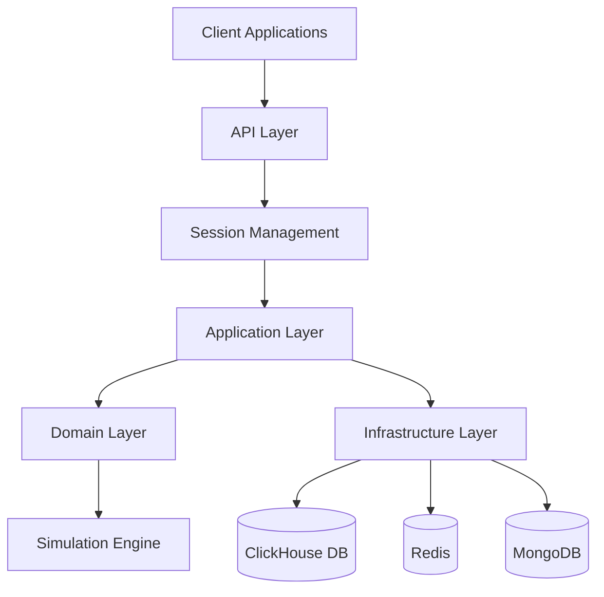
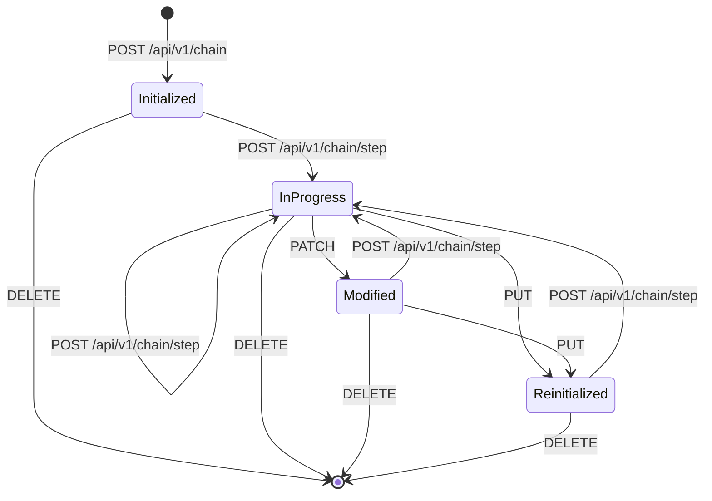
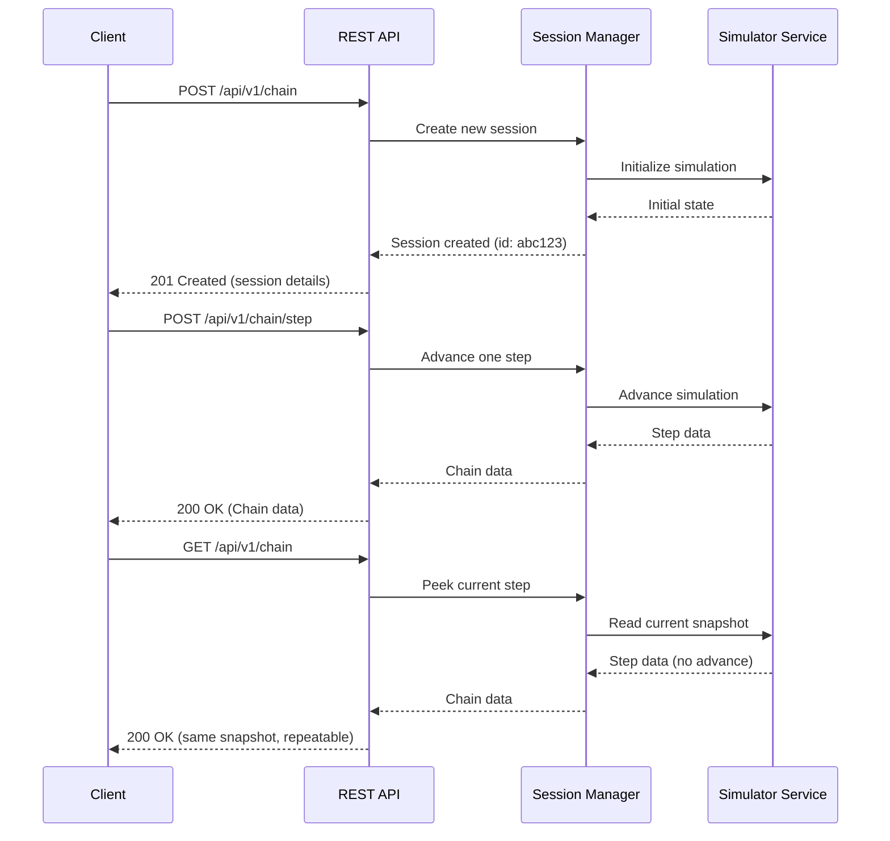
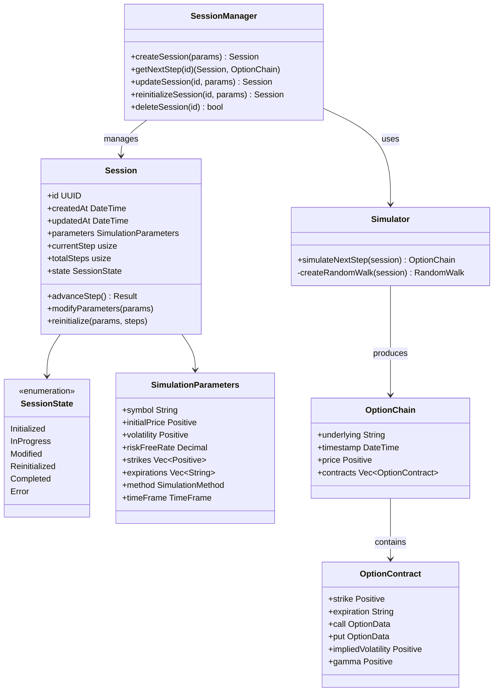
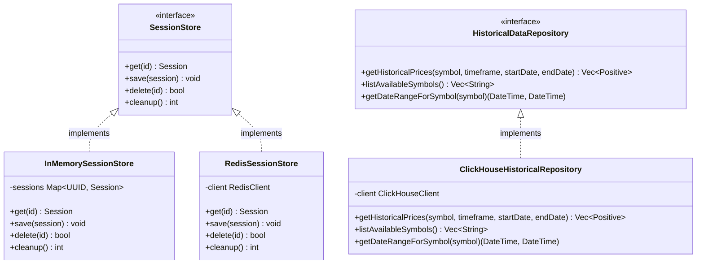

<div style="text-align: center;">

</div>

[](./LICENSE)
[](https://crates.io/crates/optionchain_simulator)
[](https://crates.io/crates/optionchain_simulator)
[](https://github.com/joaquinbejar/OptionChain-Simulator/stargazers)
[](https://github.com/joaquinbejar/OptionChain-Simulator/issues)
[](https://github.com/joaquinbejar/OptionChain-Simulator/pulls)
[](https://github.com/joaquinbejar/OptionChain-Simulator/actions)
[](https://codecov.io/gh/joaquinbejar/OptionChain-Simulator)
[](https://libraries.io/github/joaquinbejar/OptionChain-Simulator)
[](https://docs.rs/optionchain_simulator)


## OptionChain-Simulator API and Architecture

### System Architecture


```mermaid
flowchart TD
Client[Client Applications] --> API[API Layer]
API --> SM[Session Management]
SM --> App[Application Layer]
App --> Domain[Domain Layer]
App --> Infra[Infrastructure Layer]
Domain --> SimEngine[Simulation Engine]
Infra --> ClickHouse[(ClickHouse DB)]
Infra --> Redis[(Redis)]
Infra --> MongoDB[(MongoDB)]
```

### Session State Transitions


```mermaid
stateDiagram-v2
[*] --> Initialized: POST /api/v1/chain
Initialized --> InProgress: POST /api/v1/chain/step
InProgress --> InProgress: POST /api/v1/chain/step
InProgress --> Modified: PATCH
Modified --> InProgress: POST /api/v1/chain/step
InProgress --> Reinitialized: PUT
Modified --> Reinitialized: PUT
Reinitialized --> InProgress: POST /api/v1/chain/step
Initialized --> [*]: DELETE
InProgress --> [*]: DELETE
Modified --> [*]: DELETE
Reinitialized --> [*]: DELETE
```

`GET /api/v1/chain` is a safe, repeatable peek and does not appear here because it
never changes the session state — only `POST /api/v1/chain/step` advances the cursor.

### API Request Flow


```mermaid
sequenceDiagram
participant Client
participant API as REST API
participant SM as Session Manager
participant SS as Simulator Service

Client->>API: POST /api/v1/chain
API->>SM: Create new session
SM->>SS: Initialize simulation
SS-->>SM: Initial state
SM-->>API: Session created (id: abc123)
API-->>Client: 201 Created (session details)

Client->>API: POST /api/v1/chain/step
API->>SM: Advance one step
SM->>SS: Advance simulation
SS-->>SM: Step data
SM-->>API: Chain data
API-->>Client: 200 OK (Chain data)

Client->>API: GET /api/v1/chain
API->>SM: Peek current step
SM->>SS: Read current snapshot
SS-->>SM: Step data (no advance)
SM-->>API: Chain data
API-->>Client: 200 OK (same snapshot, repeatable)
```

### REST API Endpoints

The OptionChain-Simulator exposes the following REST API endpoints:

| Method | Endpoint           | Action              | Description                                                      |
|--------|--------------------|---------------------|------------------------------------------------------------------|
| POST   | /api/v1/chain      | Create Session      | Creates a new simulation session                                 |
| GET    | /api/v1/chain      | Read Current Step   | Returns the snapshot the next advance will serve (safe, repeatable)|
| POST   | /api/v1/chain/step | Advance Step        | Serves the snapshot at the cursor (index 0 first), then advances  |
| PUT    | /api/v1/chain      | Replace Session     | Completely replaces session parameters                           |
| PATCH  | /api/v1/chain      | Update Parameters   | Updates specific session parameters                              |
| DELETE | /api/v1/chain      | Delete Session      | Terminates and removes a session                                 |

**Step cursor semantics (serve-then-advance):** `current_step` is the 0-based index
of the NEXT snapshot to serve. `POST /api/v1/chain/step` serves the snapshot at the
cursor and then advances it, so a session with `steps = N` serves EXACTLY indices
`0..N-1` over `N` advances. The advance that serves the last snapshot persists the
`Completed` state, and any further advance returns `410 Gone`. `GET /api/v1/chain`
peeks the snapshot the next advance would serve without moving the cursor.

> **Migration (breaking, issue #21):** `GET /api/v1/chain` used to advance the
> session and consume a step. It is now a read-only, repeatable **peek** that returns
> the current snapshot without mutating state. To advance the cursor, clients must now
> call **`POST /api/v1/chain/step`** (same response shape, same 200/404/410/500 status
> codes as the old GET). Downstream consumers such as IronCondor must switch their
> step-advancing call from `GET /api/v1/chain` to `POST /api/v1/chain/step`.

### v2 rolling simulations

`/api/v2/simulations` is a second, parallel REST surface for deterministic
rolling multi-expiration simulations: a simulated clock instead of a
wall-clock timestamp, a rolling inventory of absolute expirations driven by
versioned schedule rules (0DTE / weekly / monthly / yearly), and one
snapshot per cursor position.

| Method | Endpoint | Action |
|--------|----------|--------|
| POST   | /api/v2/simulations              | Create a simulation and receive every replay input |
| GET    | /api/v2/simulations/{id}         | Read its metadata and effective parameters |
| GET    | /api/v2/simulations/{id}/snapshot| Peek the current snapshot (safe, repeatable) |
| POST   | /api/v2/simulations/{id}/step    | Serve the current snapshot, then advance once |
| DELETE | /api/v2/simulations/{id}         | Delete it and evict its cached state |

**Serve-then-advance**, as in v1: a simulation with `steps = N` serves
indices `0..N-1` over `N` calls to `/step`, and any call after that returns
`410 Gone`. `expected_step` on the advance is a precondition — a mismatch is
`412` with the actual cursor and consumes nothing, which is what makes a
retry after a lost response safe. It is deliberately distinct from `409`,
which means another writer committed first.

**A v2 simulation is immutable after creation.** There is no PATCH or PUT:
changing the seed, the start, the schedules or the chain shape changes the
tape, so it creates a new simulation instead of mutating one.

**Replay.** The creation response echoes the effective seed, effective
start, step interval, time frame, timezone, calendar version, IANA tzdb
release and normalised schedules — everything needed to reproduce the run
without having kept the request. The full contract is in
[ADR 0001](https://github.com/joaquinbejar/OptionChain-Simulator/blob/main/doc/adr/0001-v2-rolling-simulation-contract.md).

**`/api/v1/chain` is frozen.** Its routes, DTO fields and types, wall-clock
`timestamp` behaviour, rendered values, status codes and OpenAPI operations
are byte- and behaviour-compatible; v2 ships as a separate surface with its
own session type and its own stored-session schema, so existing clients
need no changes.

### Configuration

Every environment variable the service reads is documented in
`.env.example` with its default and accepted range. Two families, with
deliberately different failure behaviour:

- **Request caps** — `OCS_MAX_STEPS`, `OCS_MAX_CHAIN_SIZE`,
  `OCS_MAX_HISTORICAL_PRICES`, `OCS_MAX_CACHED_WALKS` — warn and fall back
  to their defaults when set to something invalid. A bad value there
  degrades one request.
- **v2 operational knobs** — `OCS_V2_RETENTION_SECS`,
  `OCS_V2_CLEANUP_INTERVAL_SECS`, `OCS_MAX_CACHED_TAPES`,
  `OCS_MAX_CACHED_SNAPSHOTS`, `OCS_MAX_EXPORT_ROWS` — are **validated at startup** and fail the
  process with a message naming the variable. Silently reverting a
  retention window would expire simulations a client is still walking, and
  silently reverting a cache bound would change the service's memory
  profile with nothing to show for it.

**v2 retention is real time, not simulated time.** A simulation whose
simulated clock spans three years is still walked one request at a time, so
its idle window is an operational choice independent of the horizon. It
defaults to an hour — longer than v1's thirty minutes — and is measured from
the last **write**: peeking a snapshot persists nothing, so a client that
only peeks does not refresh it. The in-memory and Redis backends apply the
same window from the same constant.

A retention sweep runs every `OCS_V2_CLEANUP_INTERVAL_SECS`, reaping expired
simulations and evicting the factor tapes and snapshots they left behind.
Eviction is never observable in what is served: both rebuild identically
from the effective parameters, so it costs latency and nothing else. The
sweep publishes `v2_simulations_expired_total`, and the caches publish
`v2_tape_cache_size` and `v2_snapshot_cache_size`.

### Exporting a tape

`GET /api/v2/simulations/{id}/export?dataset=…&format=…&from_step=&to_step=`
replays a simulation and streams it, which is what turns a
walked-one-request-at-a-time simulation into something a backtester loads in
one go.

| Parameter | Values |
|-----------|--------|
| `dataset` | `underlying` \| `volatility` \| `option_chains` |
| `format`  | `json` \| `csv` |
| `from_step`, `to_step` | inclusive bounds; default to the whole tape |

**Read-only in the strong sense.** The export takes an immutable snapshot of
the effective parameters and replays from those: it never advances the
cursor, changes the state or version, or alters what the next peek returns.
A simulation that has never been walked exports its whole tape, a completed
one still does, and two clients can export the same simulation at once.

**Deterministic.** Repeating an export is byte-identical: every value is a
function of the effective parameters and the cursor, timestamps render as
whole-second RFC 3339, and numbers use shortest round-trip formatting with
no locale. JSON is a single valid array; CSV is RFC 4180 with a header row
and CRLF endings, and an absent optional is an **empty** field rather than
`null` or `0`. Chain labels are joined with `|` so a shared expiration stays
one column.

The rows are produced on a blocking thread and handed over a bounded
channel, so a long `option_chains` export never occupies an Actix worker and
a slow client applies backpressure instead of accumulating priced chains in
memory. `OCS_MAX_EXPORT_ROWS` bounds how many steps one request may cover.

### Request/Response Models

#### 1. Create Session (POST /api/v1/chain)

**Request Body:**
```json
{
  "symbol": "AAPL",
  "steps": 10,
  "initial_price": 185.5,
  "days_to_expiration": 45.0,
  "volatility": 0.25,
  "risk_free_rate": 0.04,
  "dividend_yield": 0.005,
  "method": {
    "GeometricBrownian": {
      "dt": 0.004,
      "drift": 0.05,
      "volatility": 0.25
    }
  },
  "time_frame": "Day",
  "chain_size": 15,
  "strike_interval": 5.0,
  "smile_curve": 0.0005,
  "spread": 0.02
}
```

**Response (201 Created):**
```json
{
    "id": "6af613b6-569c-5c22-9c37-2ed93f31d3af",
    "created_at": "2025-04-21T15:37:30.518022+00:00",
    "updated_at": "2025-04-21T15:37:30.518022+00:00",
    "parameters": {
        "symbol": "AAPL",
        "initial_price": 185.5,
        "volatility": 0.25,
        "risk_free_rate": 0.04,
        "method": "GeometricBrownian { dt: 0.004, drift: 0.05, volatility: 0.25 }",
        "time_frame": "day",
        "dividend_yield": 0.005,
        "smile_curve": 0.0005,
        "spread": 0.02
    },
    "current_step": 0,
    "total_steps": 10,
    "state": "Initialized"
}
```

#### 2. Peek Current Step (GET /api/v1/chain?sessionid=6af613b6-569c-5c22-9c37-2ed93f31d3af)

Safe and repeatable: returns the session's current snapshot without advancing the
cursor or persisting anything. To advance the session and consume a step, use
`POST /api/v1/chain/step?sessionid=...` (issue #21) — it takes the same query
parameter and returns the same body shown below.

**Response (200 OK):**
```json
{
    "underlying": "AAPL",
    "timestamp": "2025-04-21T15:33:03.597061+00:00",
    "price": 185.299430466522,
    "contracts": [
        {
            "strike": 160.0,
            "expiration": "2025-06-05",
            "call": {
                "bid": 26.08,
                "ask": 26.1,
                "mid": 26.09,
                "delta": 0.9993778215543331
            },
            "put": {
                "bid": null,
                "ask": null,
                "mid": null,
                "delta": -4.2479708093406946e-6
            },
            "implied_volatility": 0.09731095458186256,
            "gamma": 3.121236702609213e-6
        },
        {
            "strike": 165.0,
            "expiration": "2025-06-05",
            "call": {
                "bid": 21.14,
                "ask": 21.16,
                "mid": 21.15,
                "delta": 0.9888998386575956
            },
            "put": {
                "bid": 0.03,
                "ask": 0.05,
                "mid": 0.04,
                "delta": -0.010482230867546823
            },
            "implied_volatility": 0.15077922021760087,
            "gamma": 0.0028266289100911603
        },
        {
            "strike": 170.0,
            "expiration": "2025-06-05",
            "call": {
                "bid": 16.62,
                "ask": 16.64,
                "mid": 16.63,
                "delta": 0.9153696474659715
            },
            "put": {
                "bid": 0.49,
                "ask": 0.51,
                "mid": 0.5,
                "delta": -0.08401242205917087
            },
            "implied_volatility": 0.1927733286389461,
            "gamma": 0.012279670056243013
        },
        {
            "strike": 175.0,
            "expiration": "2025-06-05",
            "call": {
                "bid": 12.87,
                "ask": 12.89,
                "mid": 12.88,
                "delta": 0.7964192920937592
            },
            "put": {
                "bid": 1.71,
                "ask": 1.73,
                "mid": 1.72,
                "delta": -0.2029627774313833
            },
            "implied_volatility": 0.22329327984589836,
            "gamma": 0.019409579420062936
        },
        {
            "strike": 180.0,
            "expiration": "2025-06-05",
            "call": {
                "bid": 9.76,
                "ask": 9.78,
                "mid": 9.77,
                "delta": 0.6700429413591044
            },
            "put": {
                "bid": 3.57,
                "ask": 3.59,
                "mid": 3.58,
                "delta": -0.3293391281660381
            },
            "implied_volatility": 0.24233907383845762,
            "gamma": 0.022910122989513254
        },
        {
            "strike": 185.0,
            "expiration": "2025-06-05",
            "call": {
                "bid": 7.09,
                "ask": 7.11,
                "mid": 7.1,
                "delta": 0.5468721177394451
            },
            "put": {
                "bid": 5.87,
                "ask": 5.89,
                "mid": 5.88,
                "delta": -0.45250995178569736
            },
            "implied_volatility": 0.24991071061662393,
            "gamma": 0.024315069945191076
        },
        {
            "strike": 190.0,
            "expiration": "2025-06-05",
            "call": {
                "bid": 4.68,
                "ask": 4.7,
                "mid": 4.69,
                "delta": 0.4237521134194814
            },
            "put": {
                "bid": 8.45,
                "ask": 8.47,
                "mid": 8.46,
                "delta": -0.5756299561056611
            },
            "implied_volatility": 0.24385078722742481,
            "gamma": 0.024638652336979393
        },
        {
            "strike": 195.0,
            "expiration": "2025-06-05",
            "call": {
                "bid": 2.62,
                "ask": 2.64,
                "mid": 2.63,
                "delta": 0.29452137751494756
            },
            "put": {
                "bid": 11.36,
                "ask": 11.38,
                "mid": 11.37,
                "delta": -0.7048606920101947
            },
            "implied_volatility": 0.22617927813392658,
            "gamma": 0.023389127623181388
        },
        {
            "strike": 200.0,
            "expiration": "2025-06-05",
            "call": {
                "bid": 1.03,
                "ask": 1.05,
                "mid": 1.04,
                "delta": 0.15952905609846607
            },
            "put": {
                "bid": 14.75,
                "ask": 14.77,
                "mid": 14.76,
                "delta": -0.8398530134266764
            },
            "implied_volatility": 0.19703361182603538,
            "gamma": 0.01891326128023662
        },
        {
            "strike": 205.0,
            "expiration": "2025-06-05",
            "call": {
                "bid": 0.16,
                "ask": 0.18,
                "mid": 0.17,
                "delta": 0.04271051015963935
            },
            "put": {
                "bid": 18.85,
                "ask": 18.87,
                "mid": 18.86,
                "delta": -0.9566715593655031
            },
            "implied_volatility": 0.15641378830375124,
            "gamma": 0.008916660747165772
        },
        {
            "strike": 210.0,
            "expiration": "2025-06-05",
            "call": {
                "bid": null,
                "ask": null,
                "mid": null,
                "delta": 0.0005597778266970925
            },
            "put": {
                "bid": 23.66,
                "ask": 23.68,
                "mid": 23.67,
                "delta": -0.9988222916984453
            },
            "implied_volatility": 0.10431980756707404,
            "gamma": 0.0002902662707065403
        }
    ],
    "session_info": {
        "id": "6af613b6-569c-5c22-9c37-2ed93f31d3af",
        "current_step": 1,
        "total_steps": 10
    }
}
```

#### 3. Update Session Parameters (PATCH /api/v1/chain?sessionid=6af613b6-569c-5c22-9c37-2ed93f31d3af)

**Request Body:**
```json
{
  "symbol": "AAPL",
   "initial_price": 385.5,
  "steps": 8,
  "volatility": 0.2,
  "risk_free_rate": 0.03,
  "dividend_yield": 0.005,
  "days_to_expiration": 30.0,
  "time_frame": "Day"
}
```

**Response (200 OK):**
```json
{
    "id": "6af613b6-569c-5c22-9c37-2ed93f31d3af",
    "created_at": "2025-04-21T15:32:59.551486+00:00",
    "updated_at": "2025-04-21T15:33:19.515911+00:00",
    "parameters": {
        "symbol": "AAPL",
        "initial_price": 385.5,
        "volatility": 0.2,
        "risk_free_rate": 0.03,
        "method": "GeometricBrownian { dt: 0.004, drift: 0.05, volatility: 0.25 }",
        "time_frame": "day",
        "dividend_yield": 0.005,
        "smile_curve": 0.0005,
        "spread": 0.02
    },
    "current_step": 0,
    "total_steps": 30,
    "state": "Reinitialized"
}
```

#### 4. Replace Session (PUT /api/v1/chain)

**Request Body:**
```json
{
  "symbol": "AAPL",
  "steps": 30,
  "initial_price": 385.5,
  "days_to_expiration": 45.0,
  "volatility": 0.25,
  "risk_free_rate": 0.04,
  "dividend_yield": 0.005,
  "method": {
    "GeometricBrownian": {
      "dt": 0.004,
      "drift": 0.05,
      "volatility": 0.25
    }
  },
  "time_frame": "Day",
  "chain_size": 15,
  "strike_interval": 5.0,
  "smile_curve": 0.0005,
  "spread": 0.02
}
```

**Response (200 OK):**
```json
{
    "id": "6af613b6-569c-5c22-9c37-2ed93f31d3af",
    "created_at": "2025-04-21T15:37:30.518022+00:00",
    "updated_at": "2025-04-21T15:37:33.951540+00:00",
    "parameters": {
        "symbol": "AAPL",
        "initial_price": 385.5,
        "volatility": 0.25,
        "risk_free_rate": 0.04,
        "method": "GeometricBrownian { dt: 0.004, drift: 0.05, volatility: 0.25 }",
        "time_frame": "day",
        "dividend_yield": 0.005,
        "smile_curve": 0.0005,
        "spread": 0.02
    },
    "current_step": 0,
    "total_steps": 30,
    "state": "Reinitialized"
}
```

#### 5. Delete Session (DELETE /api/v1/chain?sessionid=6af613b6-569c-5c22-9c37-2ed93f31d3af)

**Response (200 OK):**
```json
{
    "message": "Session deleted successfully: 6af613b6-569c-5c22-9c37-2ed93f31d3af",
    "session_id": "6af613b6-569c-5c22-9c37-2ed93f31d3af"
}
```

### Domain Models


```mermaid
classDiagram
class SessionManager {
+createSession(params) Session
+getNextStep(id) (Session, OptionChain)
+updateSession(id, params) Session
+reinitializeSession(id, params) Session
+deleteSession(id) bool
}

class Session {
+id UUID
+createdAt DateTime
+updatedAt DateTime
+parameters SimulationParameters
+currentStep usize
+totalSteps usize
+state SessionState
+advanceStep() Result
+modifyParameters(params)
+reinitialize(params, steps)
}

class SessionState {
<<enumeration>>
Initialized
InProgress
Modified
Reinitialized
Completed
Error
}

class SimulationParameters {
+symbol String
+initialPrice Positive
+volatility Positive
+riskFreeRate Decimal
+strikes Vec~Positive~
+expirations Vec~String~
+method SimulationMethod
+timeFrame TimeFrame
}

class Simulator {
+simulateNextStep(session) OptionChain
-createRandomWalk(session) RandomWalk
}

class OptionChain {
+underlying String
+timestamp DateTime
+price Positive
+contracts Vec~OptionContract~
}

class OptionContract {
+strike Positive
+expiration String
+call OptionData
+put OptionData
+impliedVolatility Positive
+gamma Positive
}

Session --> SimulationParameters
Session --> SessionState
SessionManager --> Session: manages
SessionManager --> Simulator: uses
Simulator --> OptionChain: produces
OptionChain --> OptionContract: contains
```

### Infrastructure Components


```mermaid
classDiagram
class SessionStore {
<<interface>>
+get(id) Session
+save(session) void
+delete(id) bool
+cleanup() int
}

class InMemorySessionStore {
-sessions Map~UUID, Session~
+get(id) Session
+save(session) void
+delete(id) bool
+cleanup() int
}

class RedisSessionStore {
-client RedisClient
+get(id) Session
+save(session) void
+delete(id) bool
+cleanup() int
}

class HistoricalDataRepository {
<<interface>>
+getHistoricalPrices(symbol, timeframe, startDate, endDate) Vec~Positive~
+listAvailableSymbols() Vec~String~
+getDateRangeForSymbol(symbol) (DateTime, DateTime)
}

class ClickHouseHistoricalRepository {
-client ClickHouseClient
+getHistoricalPrices(symbol, timeframe, startDate, endDate) Vec~Positive~
+listAvailableSymbols() Vec~String~
+getDateRangeForSymbol(symbol) (DateTime, DateTime)
}

SessionStore <|.. InMemorySessionStore: implements
SessionStore <|.. RedisSessionStore: implements
HistoricalDataRepository <|.. ClickHouseHistoricalRepository: implements
```

#### 🚀 Deploy the project

To deploy the services defined in `Docker/docker-compose.yml`, run the following command:

```bash
make deploy
```

This will:
- Build the Docker images (`--build`)
- Force container recreation (`--force-recreate`)
- Run everything in detached mode (`-d`)
- Use `optionchain-simulator` as the project name to namespace containers and resources

Make sure Docker and Docker Compose are installed and running on your system.
### Makefile Commands for Development

The project includes a Makefile with useful commands for development:

| Command | Description |
|---------|-------------|
| `make build` | Builds the project |
| `make release` | Builds the project in release mode |
| `make test` | Runs all tests |
| `make fmt` | Formats the code using rustfmt |
| `make lint` | Runs clippy for linting |
| `make check` | Runs tests, formatting check, and linting |
| `make run` | Runs the project |
| `make clean` | Cleans build artifacts |
| `make doc` | Generates documentation |
| `make coverage` | Generates code coverage report |
| `make bench` | Runs benchmarks |
| `make deploy` | deploy the services in local |

Additional commands for CI/CD and deployment:

| Command | Description |
|---------|-------------|
| `make pre-push` | Runs fixes, formatting, linting, and tests before pushing |
| `make workflow` | Runs all GitHub Actions workflows locally |
| `make publish` | Publishes the package to crates.io |
| `make zip` | Creates a ZIP archive of the project |


## Contribution and Contact

We welcome contributions to this project! If you would like to contribute, please follow these steps:

1. Fork the repository.
2. Create a new branch for your feature or bug fix.
3. Make your changes and ensure that the project still builds and all tests pass.
4. Commit your changes and push your branch to your forked repository.
5. Submit a pull request to the main repository.

If you have any questions, issues, or would like to provide feedback, please feel free to contact the project maintainer:

**Joaquín Béjar García**
- Email: jb@taunais.com
- GitHub: [joaquinbejar](https://github.com/joaquinbejar)

We appreciate your interest and look forward to your contributions!

## ✍️ License

Licensed under MIT license
