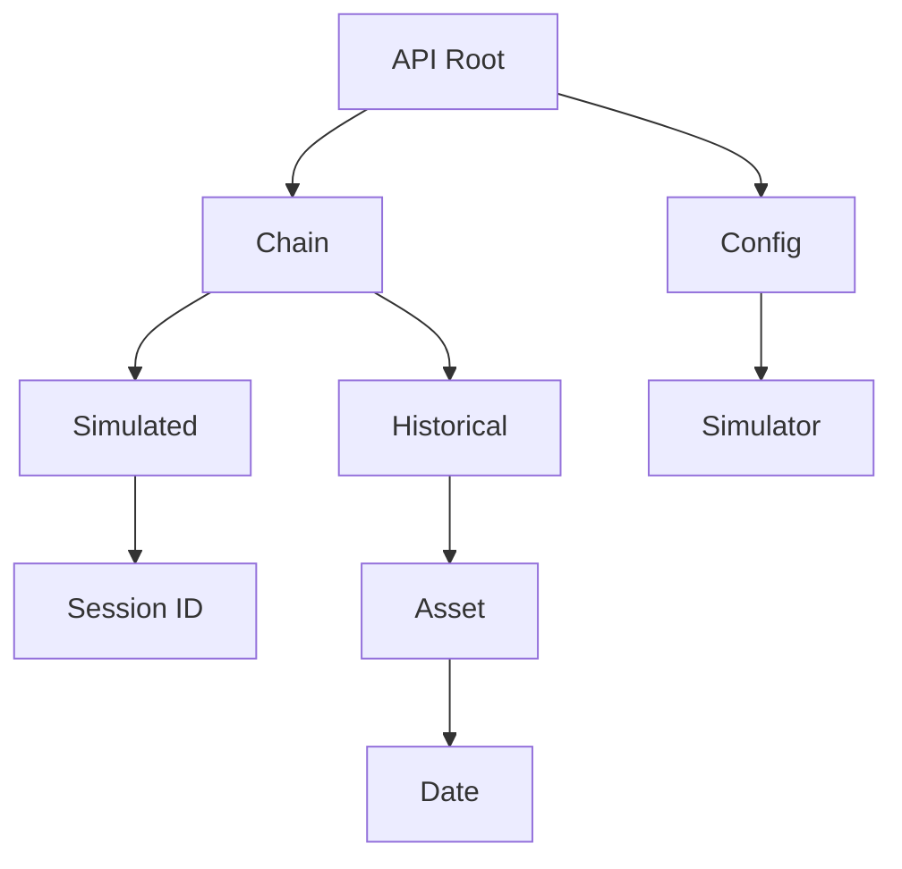
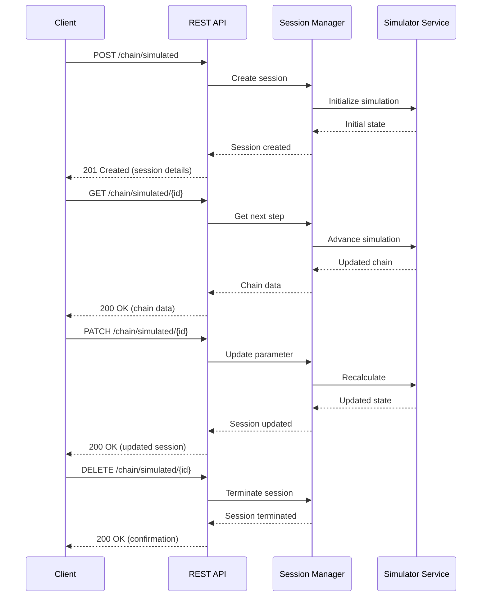

# OptionChain-Simulator API Specification

This document outlines the API endpoints, request/response formats, and expected behaviors for the OptionChain-Simulator service.

## API Overview

The OptionChain-Simulator provides a RESTful API for interacting with option chain simulations and historical data. The API adheres to REST principles and uses standard HTTP methods to perform operations on resources.

## Base URL

All API endpoints are relative to the base URL:

```
https://api.optionchainsimulator.example/v1
```

## Authentication

Authentication is handled via API keys provided in the `X-API-Key` header. For future implementations, OAuth2 authentication will be supported.

```http
GET /chain/simulated/123e4567-e89b-12d3-a456-426614174000 HTTP/1.1
Host: api.optionchainsimulator.example
X-API-Key: your_api_key_here
```

## API Versioning

The API is versioned in the URL path. The current version is `v1`.

## Resource Hierarchy



## Endpoints

### Simulation Endpoints

#### Create Simulation Session

Creates a new simulation session with specified parameters.

```
POST /chain/simulated
```

**Request Body**:

```json
{
  "initialPrice": 100.0,
  "volatility": 0.2,
  "riskFreeRate": 0.03,
  "strikes": [90, 95, 100, 105, 110],
  "expirations": ["2023-06-30", "2023-09-30"],
  "method": "GeometricBrownian"
}
```

**Response**:

```json
{
  "id": "123e4567-e89b-12d3-a456-426614174000",
  "createdAt": "2023-04-15T14:30:00Z",
  "parameters": {
    "initialPrice": 100.0,
    "volatility": 0.2,
    "riskFreeRate": 0.03,
    "strikes": [90, 95, 100, 105, 110],
    "expirations": ["2023-06-30", "2023-09-30"],
    "method": "GeometricBrownian"
  },
  "currentStep": 0,
  "totalSteps": 20,
  "state": "Initialized"
}
```

**Status Codes**:
- `201 Created`: Session successfully created
- `400 Bad Request`: Invalid parameters
- `429 Too Many Requests`: Rate limit exceeded

#### Get Next Simulation Step

Advances the simulation by one step and returns the updated option chain.

```
GET /chain/simulated/{session_id}
```

**Response**:

```json
{
  "underlying": "SIMULATION",
  "timestamp": "2023-04-15T14:35:00Z",
  "price": 101.23,
  "contracts": [
    {
      "type": "Call",
      "strike": 100.0,
      "expiration": "2023-06-30",
      "price": 5.67,
      "delta": 0.58,
      "gamma": 0.04,
      "theta": -0.03,
      "vega": 0.25
    },
    {
      "type": "Put",
      "strike": 100.0,
      "expiration": "2023-06-30",
      "price": 4.32,
      "delta": -0.42,
      "gamma": 0.04,
      "theta": -0.02,
      "vega": 0.25
    }
    // Additional contracts...
  ],
  "sessionInfo": {
    "id": "123e4567-e89b-12d3-a456-426614174000",
    "currentStep": 1,
    "totalSteps": 20
  }
}
```

**Status Codes**:
- `200 OK`: Step successfully retrieved
- `404 Not Found`: Session not found
- `410 Gone`: Session expired or terminated

#### Update Simulation Parameters

Completely replaces the simulation parameters, potentially resetting the simulation.

```
PUT /chain/simulated/{session_id}
```

**Request Body**:

```json
{
  "initialPrice": 105.0,
  "volatility": 0.25,
  "riskFreeRate": 0.035,
  "strikes": [95, 100, 105, 110, 115],
  "expirations": ["2023-06-30", "2023-09-30"],
  "method": "GeometricBrownian"
}
```

**Response**:

```json
{
  "id": "123e4567-e89b-12d3-a456-426614174000",
  "updatedAt": "2023-04-15T14:40:00Z",
  "parameters": {
    "initialPrice": 105.0,
    "volatility": 0.25,
    "riskFreeRate": 0.035,
    "strikes": [95, 100, 105, 110, 115],
    "expirations": ["2023-06-30", "2023-09-30"],
    "method": "GeometricBrownian"
  },
  "currentStep": 0,
  "totalSteps": 20,
  "state": "Reinitialized"
}
```

**Status Codes**:
- `200 OK`: Parameters successfully updated
- `400 Bad Request`: Invalid parameters
- `404 Not Found`: Session not found

#### Modify Simulation Parameters

Updates specific simulation parameters without replacing the entire configuration.

```
PATCH /chain/simulated/{session_id}
```

**Request Body**:

```json
{
  "volatility": 0.3
}
```

**Response**:

```json
{
  "id": "123e4567-e89b-12d3-a456-426614174000",
  "updatedAt": "2023-04-15T14:45:00Z",
  "parameters": {
    "initialPrice": 100.0,
    "volatility": 0.3,
    "riskFreeRate": 0.03,
    "strikes": [90, 95, 100, 105, 110],
    "expirations": ["2023-06-30", "2023-09-30"],
    "method": "GeometricBrownian"
  },
  "currentStep": 5,
  "totalSteps": 20,
  "state": "Modified"
}
```

**Status Codes**:
- `200 OK`: Parameters successfully modified
- `400 Bad Request`: Invalid parameters
- `404 Not Found`: Session not found

#### Delete Simulation Session

Terminates and removes a simulation session.

```
DELETE /chain/simulated/{session_id}
```

**Response**:

```json
{
  "message": "Session successfully terminated",
  "id": "123e4567-e89b-12d3-a456-426614174000"
}
```

**Status Codes**:
- `200 OK`: Session successfully terminated
- `404 Not Found`: Session not found

### Historical Data Endpoints

#### Get Historical Option Chain

Retrieves a reconstructed option chain for a specified asset on a particular date.

```
GET /chain/historical/{asset}/{date}
```

**Parameters**:
- `asset`: Asset identifier (e.g., "GOLD", "OIL")
- `date`: Date in ISO 8601 format (YYYY-MM-DD)

**Response**:

```json
{
  "underlying": "GOLD",
  "timestamp": "2022-06-15T00:00:00Z",
  "price": 1825.40,
  "contracts": [
    {
      "type": "Call",
      "strike": 1800.0,
      "expiration": "2022-07-30",
      "price": 65.23,
      "impliedVolatility": 0.18
    },
    {
      "type": "Put",
      "strike": 1800.0,
      "expiration": "2022-07-30",
      "price": 39.85,
      "impliedVolatility": 0.20
    }
    // Additional contracts...
  ]
}
```

**Status Codes**:
- `200 OK`: Data successfully retrieved
- `404 Not Found`: Asset or date not found in database
- `400 Bad Request`: Invalid asset or date format

### Configuration Endpoints

#### Get Simulator Configuration

Retrieves the current global configuration for the simulator.

```
GET /config/simulator
```

**Response**:

```json
{
  "defaultParameters": {
    "initialPrice": 100.0,
    "volatility": 0.2,
    "riskFreeRate": 0.03,
    "strikesCount": 5,
    "strikesSpread": 0.1,
    "expirations": ["30d", "90d"],
    "method": "GeometricBrownian"
  },
  "limits": {
    "maxSessions": 10,
    "sessionTTL": 1800,
    "maxSteps": 100,
    "maxStrikes": 20,
    "maxExpirations": 5
  }
}
```

**Status Codes**:
- `200 OK`: Configuration successfully retrieved

#### Update Simulator Configuration (Admin Only)

Updates the global configuration for the simulator.

```
PUT /config/simulator
```

**Request Body**:

```json
{
  "defaultParameters": {
    "initialPrice": 100.0,
    "volatility": 0.25,
    "riskFreeRate": 0.035,
    "strikesCount": 7,
    "strikesSpread": 0.15,
    "expirations": ["30d", "60d", "90d"],
    "method": "GeometricBrownian"
  },
  "limits": {
    "maxSessions": 20,
    "sessionTTL": 3600,
    "maxSteps": 200,
    "maxStrikes": 30,
    "maxExpirations": 10
  }
}
```

**Response**:

```json
{
  "message": "Configuration successfully updated",
  "updatedAt": "2023-04-15T15:00:00Z"
}
```

**Status Codes**:
- `200 OK`: Configuration successfully updated
- `400 Bad Request`: Invalid configuration
- `403 Forbidden`: Insufficient permissions

## HTTP Status Codes

The API uses standard HTTP status codes to indicate the success or failure of requests:

| Code | Description |
|------|-------------|
| 200 | OK - The request was successful |
| 201 | Created - A new resource was successfully created |
| 400 | Bad Request - The request was invalid or cannot be served |
| 401 | Unauthorized - Authentication is required and has failed |
| 403 | Forbidden - The request is not allowed |
| 404 | Not Found - The requested resource does not exist |
| 409 | Conflict - The request could not be completed due to a conflict |
| 410 | Gone - The resource requested is no longer available |
| 429 | Too Many Requests - Rate limit has been exceeded |
| 500 | Internal Server Error - An error occurred on the server |

## Request/Response Flow



## Data Models

### Option Chain

```json
{
  "underlying": "string",       // Underlying asset identifier
  "timestamp": "ISO-8601 date", // Time of the chain data
  "price": "number",            // Current price of the underlying
  "contracts": [                // Array of option contracts
    {
      "type": "Call|Put",       // Option type
      "strike": "number",       // Strike price
      "expiration": "ISO-8601 date", // Expiration date
      "price": "number",        // Option price
      "delta": "number",        // Optional: Delta greek
      "gamma": "number",        // Optional: Gamma greek
      "theta": "number",        // Optional: Theta greek
      "vega": "number",         // Optional: Vega greek
      "impliedVolatility": "number" // Optional: IV
    }
  ],
  "sessionInfo": {              // Optional: Included for simulation responses
    "id": "UUID",               // Session identifier
    "currentStep": "number",    // Current simulation step
    "totalSteps": "number"      // Total steps in simulation
  }
}
```

### Simulation Parameters

```json
{
  "initialPrice": "number",     // Starting price of the underlying
  "volatility": "number",       // Volatility parameter (0.0-1.0)
  "riskFreeRate": "number",     // Risk-free interest rate
  "strikes": ["number"],        // Array of strike prices
  "expirations": ["ISO-8601 date"], // Array of expiration dates
  "method": "string"            // Pricing model to use
}
```

### Session

```json
{
  "id": "UUID",                 // Unique session identifier
  "createdAt": "ISO-8601 date", // Creation timestamp
  "updatedAt": "ISO-8601 date", // Last update timestamp
  "parameters": {               // Simulation parameters
    // See Simulation Parameters model
  },
  "currentStep": "number",      // Current step in the simulation
  "totalSteps": "number",       // Total steps planned
  "state": "string"             // Session state
}
```

## Rate Limiting

The API implements rate limiting to prevent abuse. Limits are applied per API key:

- 100 requests per minute for standard tier
- 1000 requests per minute for premium tier

Rate limit information is included in response headers:

```
X-RateLimit-Limit: 100
X-RateLimit-Remaining: 95
X-RateLimit-Reset: 1618505400
```

When the rate limit is exceeded, a 429 Too Many Requests response is returned.

## Pagination

For endpoints that return collections, pagination is supported using the following query parameters:

- `page`: Page number (1-based)
- `limit`: Number of items per page (default: 20, max: 100)

Response includes pagination metadata:

```json
{
  "data": [
    // Collection items
  ],
  "pagination": {
    "total": 42,
    "page": 1,
    "limit": 20,
    "pages": 3
  }
}
```

## Error Handling

Error responses follow a consistent format:

```json
{
  "error": {
    "code": "string",    
    "message": "string", 
    "details": {}        
  }
}
```

Example error response:

```json
{
  "error": {
    "code": "invalid_parameters",
    "message": "One or more parameters are invalid",
    "details": {
      "volatility": "Must be between 0.0 and 1.0"
    }
  }
}
```

## Future API Extensions

In future versions, the API will support:

1. WebSocket connections for real-time updates
2. GraphQL endpoint for more flexible queries
3. Batch operations for bulk processing
4. Export functionality to various formats (CSV, Excel)

## API Client Libraries

Official client libraries will be provided for:

- Python
- Rust
- Go
- C++


## Developer Tools

A Swagger/OpenAPI specification is available at:

```
https://api.optionchainsimulator.example/docs/openapi.json
```

Interactive API documentation is available at:

```
https://api.optionchainsimulator.example/docs
```