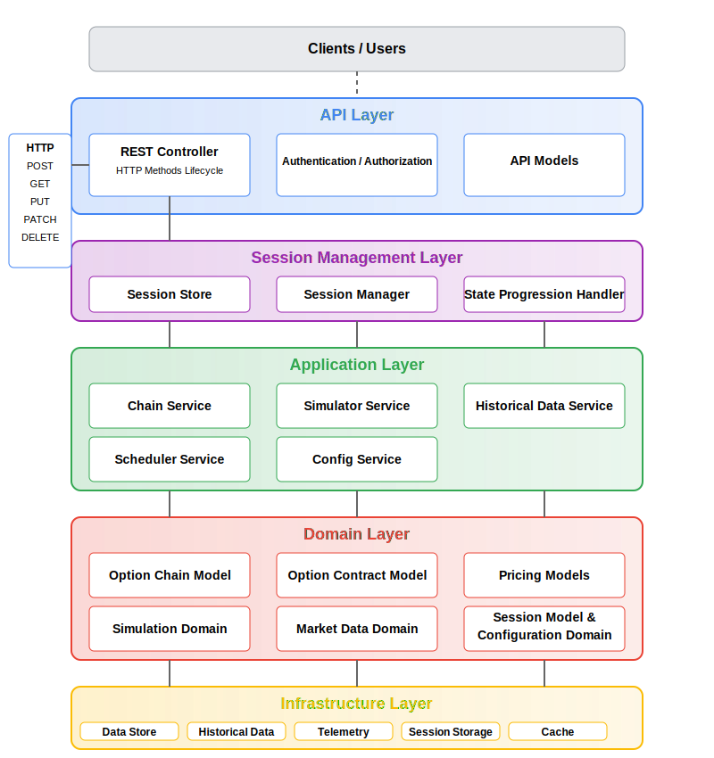
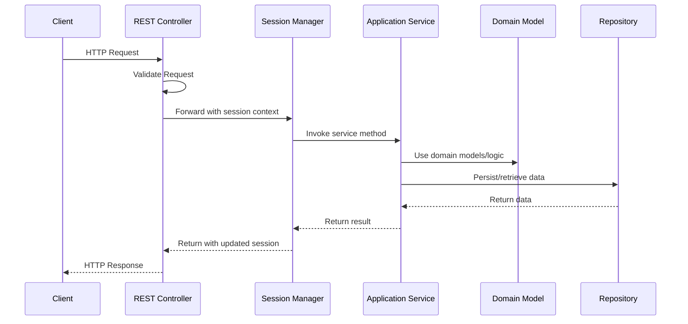
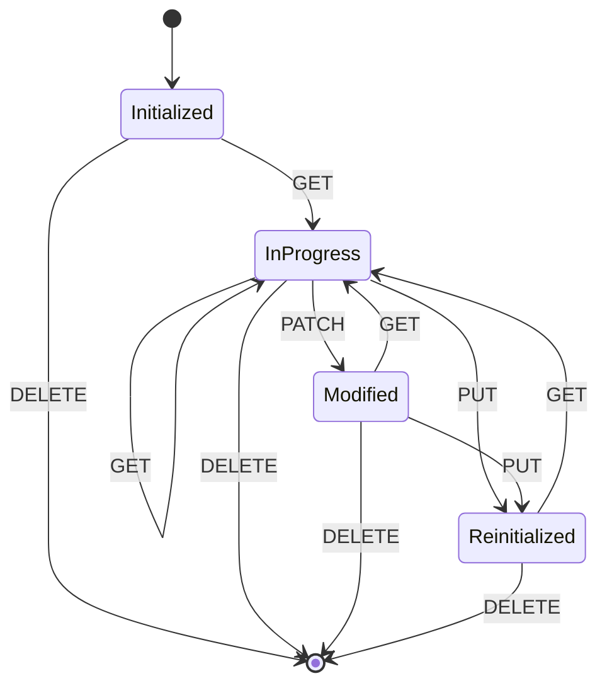
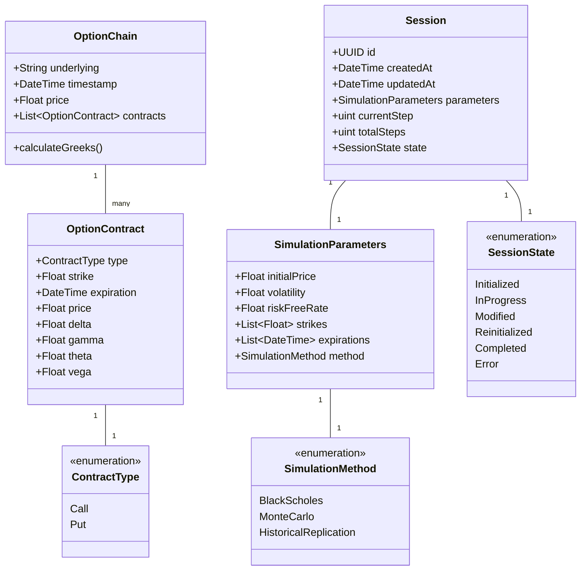
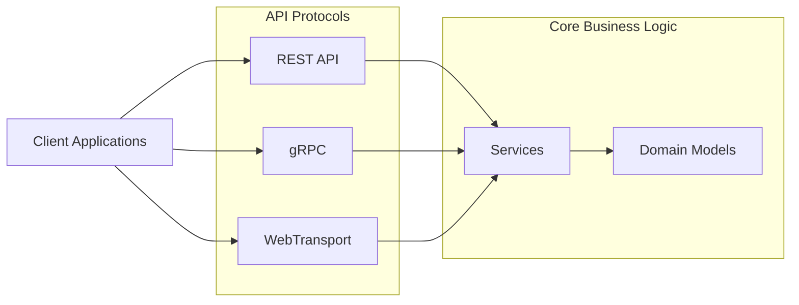

# OptionChain-Simulator Architecture Design

This document outlines the architecture of the OptionChain-Simulator system, a backend service designed to provide option chain data through various interfaces.

## System Overview

OptionChain-Simulator is designed to provide financial option chain data through a flexible API. The system supports both simulated data (using random walk models and Black-Scholes pricing) and historical reconstructed data for assets like gold or oil.

## Architecture Principles

- **Modular Design**: Clear separation between layers to allow components to evolve independently
- **Domain-Driven Design**: Core business logic isolated in the domain layer
- **Interface-Based Communication**: Subsystems communicate through well-defined interfaces
- **Protocol Agnostic**: Business logic doesn't depend on specific API protocols
- **Stateful Sessions**: Support for long-running simulation sessions with fine-grained control

## System Architecture

The architecture follows a layered approach with clear boundaries between components:

### Layer Responsibilities

1. **API Layer**
    - Handles HTTP/network protocol concerns
    - Translates between external formats and internal models
    - Routes requests to appropriate application services
    - Currently implements REST, designed to support gRPC and WebTransport in the future

2. **Session Management Layer**
    - Manages the lifecycle of simulation sessions
    - Controls state progression of simulations
    - Provides stateful interaction across multiple requests

3. **Application Layer**
    - Orchestrates use cases by coordinating domain objects and infrastructure
    - Implements business processes that span multiple domain objects
    - Handles cross-cutting concerns

4. **Domain Layer**
    - Contains business models and core logic
    - Implements domain-specific calculations and validations
    - Defines the ubiquitous language of the system

5. **Infrastructure Layer**
    - Provides technical capabilities to higher layers
    - Implements persistence, logging, metrics, etc.
    - Adapts external systems and libraries

## Component Interactions

### API Request Flow

## Session Management

The system implements a stateful session model that allows clients to interact with simulations across multiple requests.

### Session Lifecycle

### HTTP Method Mapping

Different HTTP methods are mapped to specific session operations:

| HTTP Method | Operation | Description |
|-------------|-----------|-------------|
| POST | Create | Creates the session and prepares all subsequent steps |
| GET | Read Next | Reads the next step in the simulation |
| PUT | Replace | Updates the entire session (changing all parameters) |
| PATCH | Update | Updates specific parameters of the session (e.g., volatility) |
| DELETE | Remove | Terminates and removes the session |

### Session Flow Example

1. **Client sends a POST to `/chain/simulated`**:
    - REST Controller receives request
    - Session Manager creates a new session with unique ID
    - Simulator Service initializes parameters
    - State Progression Handler prepares all simulation steps
    - Response includes session ID and initial state

2. **Client sends a GET to `/chain/simulated/:session_id`**:
    - Session Manager retrieves session
    - State Progression Handler advances to next step
    - Simulator Service calculates new option chain values
    - Returns updated chain data

3. **Client sends a PUT to `/chain/simulated/:session_id`**:
    - Session Manager retrieves session
    - Completely replaces simulation parameters
    - Simulator Service reinitializes with new parameters
    - State Progression Handler resets progression if needed

4. **Client sends a PATCH to `/chain/simulated/:session_id`**:
    - Updates specific parameters (e.g., just volatility)
    - Maintains other parameters and current state
    - May trigger recalculation based on changed parameters

5. **Client sends a DELETE to `/chain/simulated/:session_id`**:
    - Session Manager terminates and removes the session
    - Resources are freed

## Domain Models

### Core Domain Objects

## API Endpoints

The system exposes the following REST endpoints in the initial implementation:

- `POST /chain/simulated` - Create a new simulation session
- `GET /chain/simulated/:session_id` - Get the next step in the simulation
- `PUT /chain/simulated/:session_id` - Replace all simulation parameters
- `PATCH /chain/simulated/:session_id` - Update specific simulation parameters
- `DELETE /chain/simulated/:session_id` - Terminate and remove a session
- `GET /chain/historical/:asset/:date` - Get a historical chain for an asset at a specific date

## Future Protocol Support

The architecture is designed to allow future support for additional protocols:

1. **gRPC**: For high-performance server-to-server communication
2. **WebTransport**: For low-latency, real-time data streaming to web clients

## Scalability Considerations

1. **Horizontal Scaling**:
    - Session data can be distributed across multiple nodes using consistent hashing
    - Read-heavy operations can be handled by read replicas

2. **Vertical Scaling**:
    - Computation-intensive operations (simulation) can be optimized with Rust's performance

3. **Caching Strategy**:
    - Frequently accessed option chains cached in memory
    - Session state cached with TTL based on activity

4. **Database Partitioning**:
    - Historical data partitioned by asset and time period
    - Session data partitioned by creation date

## Security Considerations

1. **Authentication/Authorization**:
    - Prepared for future multi-user support with role-based access control
    - Session ownership validation

2. **Rate Limiting**:
    - Prevents abuse of computational resources
    - Per-user and per-endpoint limits

3. **Input Validation**:
    - All client inputs validated for range and format
    - Protection against malicious parameters

## Monitoring and Observability

1. **Logging**:
    - Structured logs for debugging and audit
    - Performance critical paths instrumented

2. **Metrics**:
    - Request latency by endpoint
    - Simulation performance metrics
    - Error rates and types

3. **Tracing**:
    - Distributed tracing for request flows
    - Session lifecycle events tracked