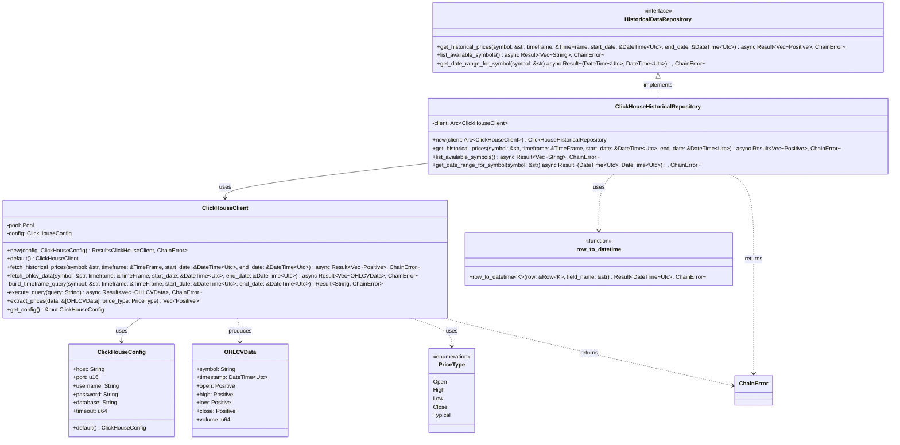
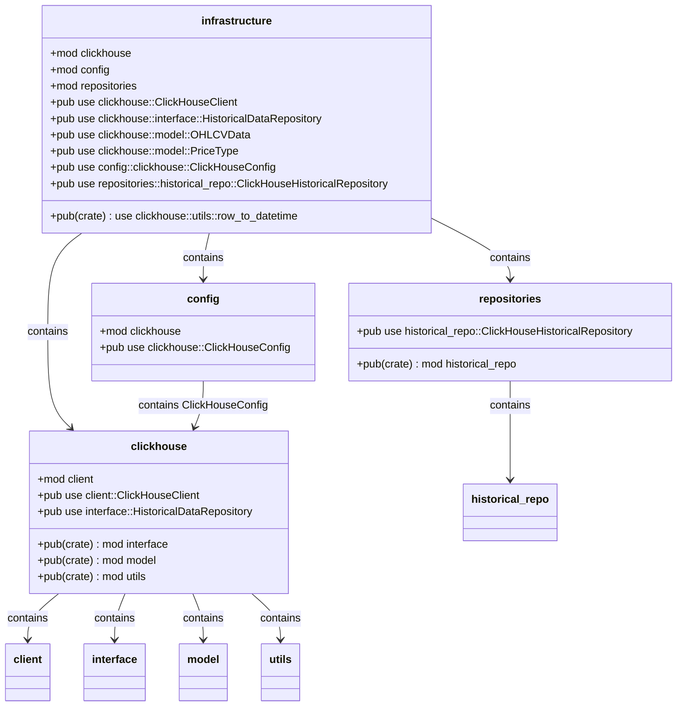
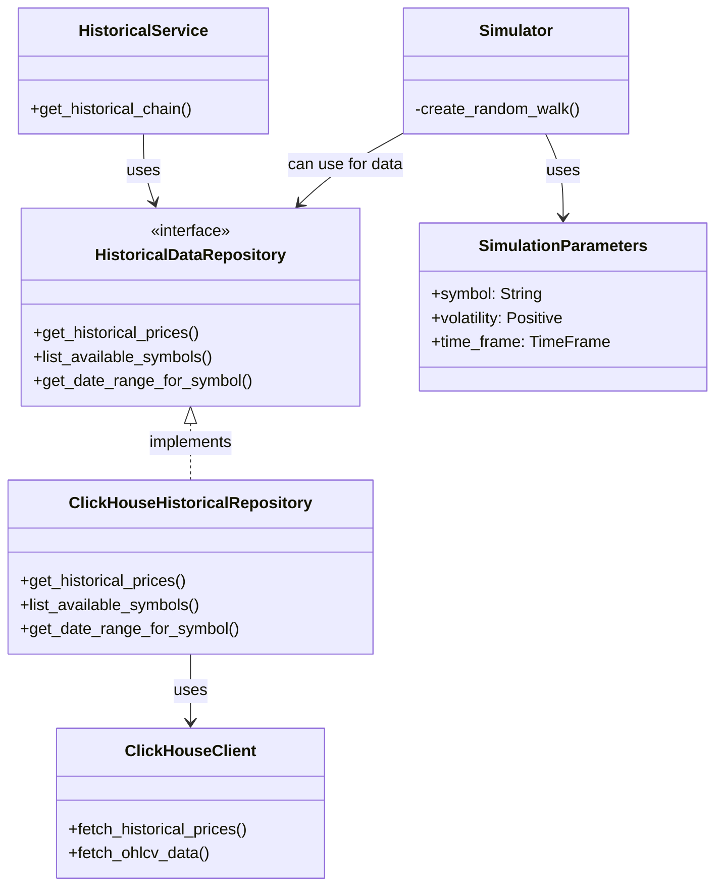

# ClickHouse Integration: Architecture Documentation

## Introduction

The ClickHouse integration component provides access to historical price data stored in a ClickHouse database. It retrieves time series financial data for various symbols and timeframes, making it available for option chain simulation and historical analysis.

## ClickHouse Component Architecture



## Module Structure

The ClickHouse integration is organized into several modules:



## Data Models

The ClickHouse integration defines key data models for working with financial time series data:

### OHLCVData

This struct represents OHLCV (Open, High, Low, Close, Volume) data points:

```rust
pub struct OHLCVData {
    pub symbol: String,
    pub timestamp: DateTime<Utc>,
    pub open: Positive,
    pub high: Positive,
    pub low: Positive,
    pub close: Positive,
    pub volume: u64,
}
```

### PriceType

This enum defines the different types of prices that can be extracted from OHLCV data:

```rust
pub enum PriceType {
    Open,    // Opening price
    High,    // Highest price
    Low,     // Lowest price
    Close,   // Closing price
    Typical, // (High + Low + Close) / 3
}
```

## Repository Pattern

The ClickHouse integration follows the Repository pattern to abstract data access:

### HistoricalDataRepository Interface

```rust
#[async_trait]
pub trait HistoricalDataRepository: Send + Sync {
    async fn get_historical_prices(
        &self,
        symbol: &str,
        timeframe: &TimeFrame,
        start_date: &DateTime<Utc>,
        end_date: &DateTime<Utc>,
    ) -> Result<Vec<Positive>, ChainError>;

    async fn list_available_symbols(&self) -> Result<Vec<String>, ChainError>;

    async fn get_date_range_for_symbol(
        &self,
        symbol: &str,
    ) -> Result<(DateTime<Utc>, DateTime<Utc>), ChainError>;
}
```

### ClickHouseHistoricalRepository Implementation

The `ClickHouseHistoricalRepository` implements the `HistoricalDataRepository` interface using ClickHouse:

```rust
pub struct ClickHouseHistoricalRepository {
    client: Arc<ClickHouseClient>,
}

impl ClickHouseHistoricalRepository {
    pub fn new(client: Arc<ClickHouseClient>) -> Self {
        Self { client }
    }
}

#[async_trait]
impl HistoricalDataRepository for ClickHouseHistoricalRepository {
    // Implementation of get_historical_prices, list_available_symbols, get_date_range_for_symbol
}
```

## Integration with Other Components

The ClickHouse component integrates with other parts of the system:



The primary integrations:

1. **HistoricalService**: Uses the `HistoricalDataRepository` to obtain historical price data for building option chains
2. **Simulator**: Can use historical data from the `HistoricalDataRepository` as a basis for simulation, including for calibrating volatility

## Query Building and Execution

The ClickHouse client includes methods for building and executing queries:

### Building Timeframe Queries

The `build_timeframe_query` method constructs SQL queries for different timeframes:

Example SQL for minute data:
```sql
SELECT symbol, toInt64(toUnixTimestamp(timestamp)) as timestamp, 
open, high, low, close, toUInt64(volume) as volume
FROM ohlcv
WHERE symbol = 'SYMBOL'
AND timestamp BETWEEN toDateTime('START_DATE') AND toDateTime('END_DATE')
ORDER BY timestamp
```

For larger timeframes (Hour, Day, Week, Month), it aggregates data:
```sql
WITH intervals AS (
    SELECT 
        symbol,
        toStartOfInterval(timestamp, INTERVAL 1 MINUTE) as interval_start,
        any(open) as open,
        max(high) as high,
        min(low) as low,
        any(close) as close,
        sum(volume) as volume
    FROM ohlcv
    WHERE symbol = 'SYMBOL' 
    AND timestamp BETWEEN 'START_DATE' AND 'END_DATE'
    GROUP BY symbol, interval_start
    ORDER BY interval_start
)
SELECT 
    symbol,
    toInt64(toUnixTimestamp(interval_start)) as timestamp,
    open, high, low, close, volume
FROM intervals
```

### Executing Queries

The `execute_query` method executes SQL queries and transforms results into `OHLCVData`:


## Error Handling

The ClickHouse component uses the `ChainError` enum for error handling:


Specific error cases:

- Connection failures
- Query execution errors
- Invalid timestamp conversions
- Missing data

## Configuration

The `ClickHouseConfig` struct manages configuration for ClickHouse connections:

```rust
pub struct ClickHouseConfig {
    pub host: String,
    pub port: u16,
    pub username: String,
    pub password: String,
    pub database: String,
    pub timeout: u64,
}
```

The default implementation reads values from environment variables:

```rust
impl Default for ClickHouseConfig {
    fn default() -> Self {
        let port = env::var("CLICKHOUSE_PORT")
            .ok()
            .and_then(|s| s.parse::<u16>().ok())
            .unwrap_or(9000);

        Self {
            host: env::var("CLICKHOUSE_HOST").unwrap_or_else(|_| "localhost".to_string()),
            port,
            username: env::var("CLICKHOUSE_USER").unwrap_or_else(|_| "admin".to_string()),
            password: env::var("CLICKHOUSE_PASSWORD").unwrap_or_else(|_| "password".to_string()),
            database: env::var("CLICKHOUSE_DB").unwrap_or_else(|_| "default".to_string()),
            timeout: 30,
        }
    }
}
```

Environment variables:
- `CLICKHOUSE_HOST`: Hostname (default: "localhost")
- `CLICKHOUSE_PORT`: Port number (default: 9000)
- `CLICKHOUSE_USER`: Username (default: "admin")
- `CLICKHOUSE_PASSWORD`: Password (default: "password")
- `CLICKHOUSE_DB`: Database name (default: "default")