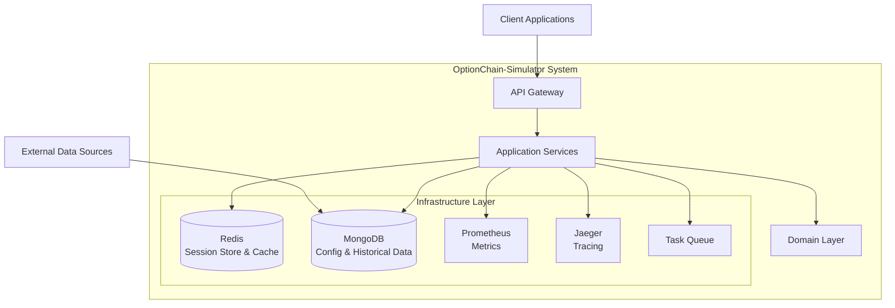
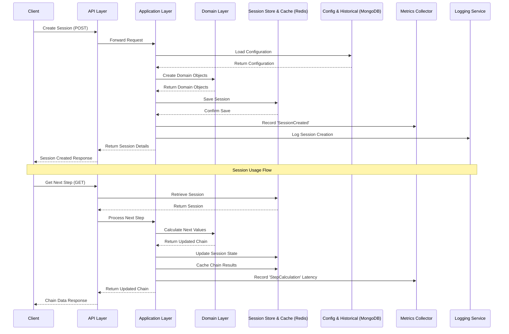
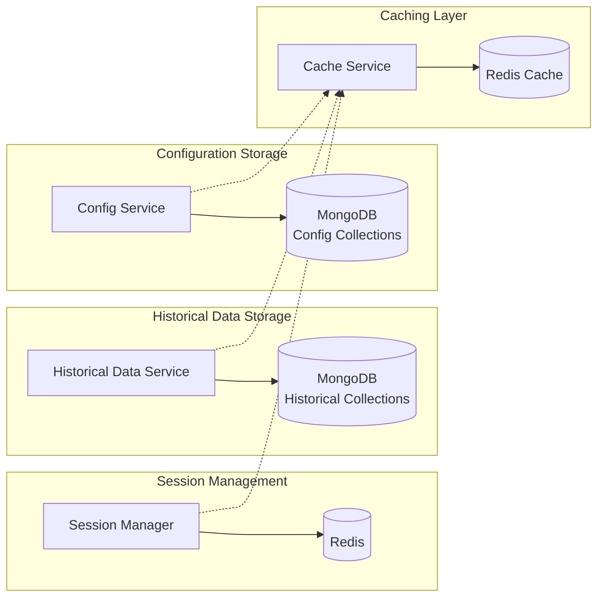
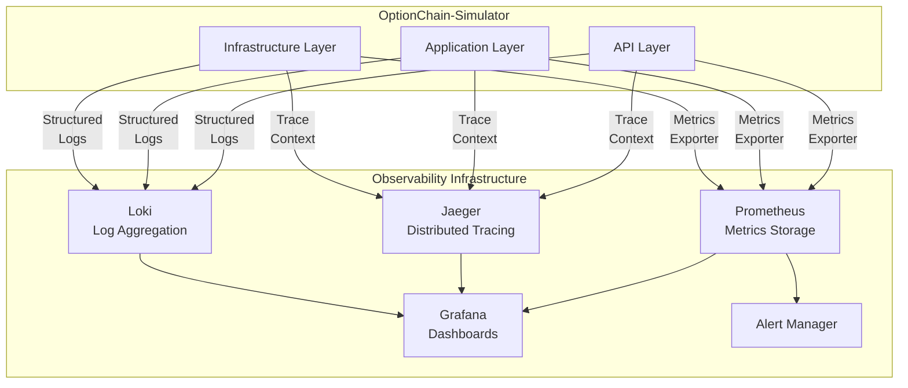
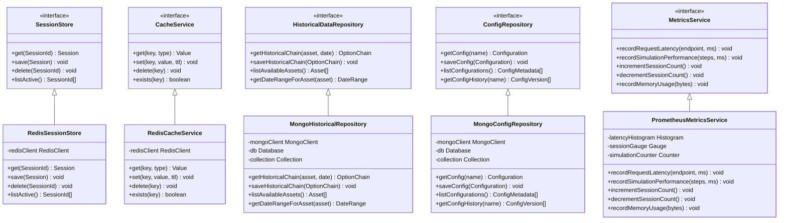

# OptionChain-Simulator: Infrastructure Layer Architecture

This document outlines the infrastructure layer of the OptionChain-Simulator system, highlighting the components, their interactions, deployment options, and integration with the overall architecture.

## 1. Infrastructure Layer Components

The infrastructure layer provides essential technical capabilities to support the application and domain layers.

```mermaid
classDiagram
    class InfrastructureLayer {
        <<interface>>
    }

    class PersistenceAdapter {
        +saveSession(Session) void
        +loadSession(SessionId) Session
        +cleanupExpiredSessions() void
    }

    class LoggingAdapter {
        +logInfo(message, context) void
        +logError(error, context) void
        +logMetric(name, value, tags) void
    }

    class ConfigurationAdapter {
        +loadConfig() Configuration
        +saveConfig(Configuration) void
        +getParameter(key) Value
    }

    class MetricsCollector {
        +recordLatency(endpoint, time) void
        +incrementCounter(name) void
        +gaugeValue(name, value) void
    }

    class SchedulerAdapter {
        +scheduleTask(task, timing) TaskId
        +cancelTask(TaskId) void
        +listScheduledTasks() Task[]
    }

    class DataSourceAdapter {
        +fetchHistoricalData(asset, date) Data
        +storeSimulationResult(SimulationResult) void
        +queryTimeSeriesData(asset, period) TimeSeries
    }

    class CacheAdapter {
        +get(key) Value
        +set(key, value, ttl) void
        +delete(key) void
        +exists(key) boolean
    }

    InfrastructureLayer <|-- PersistenceAdapter
    InfrastructureLayer <|-- LoggingAdapter
    InfrastructureLayer <|-- ConfigurationAdapter
    InfrastructureLayer <|-- MetricsCollector
    InfrastructureLayer <|-- SchedulerAdapter
    InfrastructureLayer <|-- DataSourceAdapter
    InfrastructureLayer <|-- CacheAdapter
```

## 2. Infrastructure Deployment Architecture

This diagram shows how the infrastructure components are deployed and integrated with the other layers of the system.

## 3. Session Management with Infrastructure Components

This sequence diagram illustrates how different infrastructure components interact during session creation and usage.

## 4. Data Persistence Infrastructure Design

The system implements specific storage solutions for different types of data.

## 5. Infrastructure Monitoring & Observability

This diagram shows how monitoring and observability are implemented across the system.

## 6. Detailed Infrastructure Components

This diagram shows the interfaces and concrete implementations for key infrastructure components aligned with our technology choices.

## 7. Infrastructure Implementation Recommendations

### Storage Technologies

1. **Session Storage & Cache**
    - **Redis**: Fast, in-memory data store for both session management and caching
    - Configuration:
        - Enable persistence with RDB snapshots and AOF logs
        - Use Redis Cluster for high availability in production
        - Configure appropriate eviction policies for cache data

2. **Historical & Configuration Data**
    - **MongoDB**: Document-oriented database ideal for JSON-like data structures
    - Configuration:
        - Create separate collections for historical data and configurations
        - Use time-series collections for historical option chains (MongoDB 5.0+)
        - Implement appropriate indexing on asset, date, and expiration fields
        - Enable sharding for horizontal scaling in production

### Observability Stack

1. **Metrics**: Prometheus for metrics collection and alerting
2. **Logging**: OpenTelemetry + Loki for structured, centralized logging
3. **Tracing**: Jaeger for distributed tracing across service boundaries
4. **Dashboards**: Grafana for visualization of metrics, logs, and traces

### Redis Implementation

1. **Session Management**:
    - Use Hash data structures for session storage
    - Implement automatic TTL for session cleanup
    - Use Redis transactions for atomic operations on sessions

2. **Caching Strategy**:
    - Cache frequently accessed option chains and configurations
    - Implement cache invalidation on configuration updates
    - Use tiered caching with shorter TTL for volatile data

### MongoDB Implementation

1. **Data Modeling**:
    - Design document schemas that reflect domain models
    - Use embedded documents for closely related data
    - Implement versioning for configuration documents

2. **Query Optimization**:
    - Create compound indexes for common query patterns
    - Use aggregation pipeline for analytics
    - Implement proper projection to retrieve only needed fields

## 8. Scaling Considerations

1. **Horizontal Scaling**
    - Redis Cluster for distributed session data and caching
    - MongoDB sharding for historical data partitioned by asset and time period
    - Stateless API layer can be scaled with load balancing

2. **Vertical Scaling**
    - Optimize Rust code for multi-threading to utilize available CPU cores
    - Configure appropriate connection pools for database connections
    - Implement efficient memory usage patterns

3. **Caching Strategies**
    - Implement intelligent cache warming for predictable data access patterns
    - Use staggered TTLs to prevent cache stampedes
    - Implement circuit breakers for database fallbacks when cache misses occur

4. **Read/Write Separation**
    - Configure MongoDB read preferences to utilize secondary nodes
    - Implement write-through cache for Redis to ensure consistency

## 9. Infrastructure Security

1. **Database Security**
    - Enable authentication for Redis and MongoDB
    - Implement TLS for all database connections
    - Use network isolation with VPC/subnets

2. **Authentication/Authorization**
    - API Key validation via middleware
    - Role-based access control for administrative endpoints
    - JWT or OAuth2 for user authentication in multi-tenant scenarios

3. **Data Security**
    - Encrypt sensitive data at rest
    - Implement proper data sanitization for all inputs
    - Regular security audits and dependency scanning

4. **Rate Limiting and Abuse Prevention**
    - Implement rate limiting using Redis
    - Set up monitoring for unusual access patterns
    - Implement IP-based throttling for public-facing endpoints

## 10. Disaster Recovery

1. **Backup Strategies**
    - Regular snapshots of Redis data
    - MongoDB replica sets with automated backups
    - Geographically distributed backups

2. **Failover Mechanisms**
    - Redis Sentinel for automatic failover
    - MongoDB replica sets with automatic primary election
    - Automated recovery procedures with health checks

3. **Monitoring and Alerting**
    - Implement heartbeat monitoring for all services
    - Set up alerts for database performance degradation
    - Create runbooks for common recovery scenarios