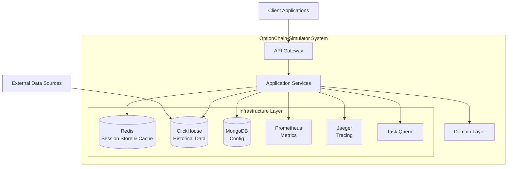
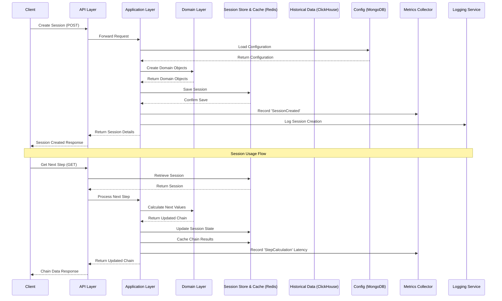
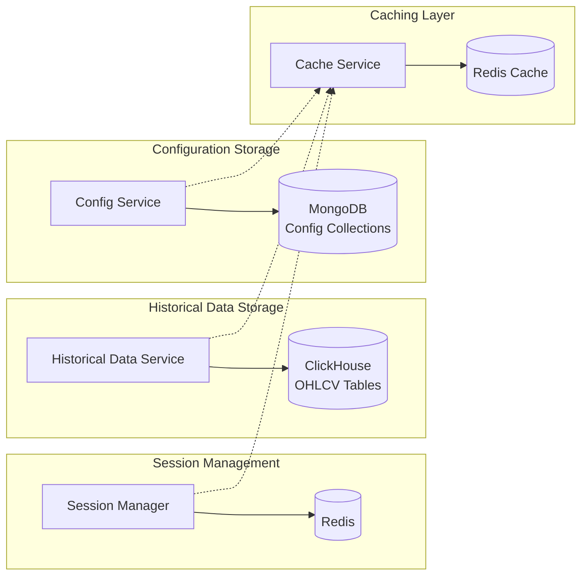
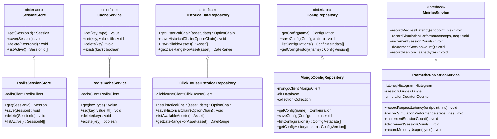

# OptionChain-Simulator: Infrastructure Layer Architecture

This document outlines the infrastructure layer of the OptionChain-Simulator system, highlighting the components, their interactions, deployment options, and integration with the overall architecture.

## 1. Infrastructure Layer Components

The infrastructure layer provides essential technical capabilities to support the application and domain layers.

```mermaid
classDiagram
    class InfrastructureLayer {
        <<interface>>
    }

    class PersistenceAdapter {
        +saveSession(Session) void
        +loadSession(SessionId) Session
        +cleanupExpiredSessions() void
    }

    class LoggingAdapter {
        +logInfo(message, context) void
        +logError(error, context) void
        +logMetric(name, value, tags) void
    }

    class ConfigurationAdapter {
        +loadConfig() Configuration
        +saveConfig(Configuration) void
        +getParameter(key) Value
    }

    class MetricsCollector {
        +recordLatency(endpoint, time) void
        +incrementCounter(name) void
        +gaugeValue(name, value) void
    }

    class SchedulerAdapter {
        +scheduleTask(task, timing) TaskId
        +cancelTask(TaskId) void
        +listScheduledTasks() Task[]
    }

    class DataSourceAdapter {
        +fetchHistoricalData(asset, date) Data
        +storeSimulationResult(SimulationResult) void
        +queryTimeSeriesData(asset, period) TimeSeries
    }

    class CacheAdapter {
        +get(key) Value
        +set(key, value, ttl) void
        +delete(key) void
        +exists(key) boolean
    }

    InfrastructureLayer <|-- PersistenceAdapter
    InfrastructureLayer <|-- LoggingAdapter
    InfrastructureLayer <|-- ConfigurationAdapter
    InfrastructureLayer <|-- MetricsCollector
    InfrastructureLayer <|-- SchedulerAdapter
    InfrastructureLayer <|-- DataSourceAdapter
    InfrastructureLayer <|-- CacheAdapter
```

## 2. Infrastructure Deployment Architecture

This diagram shows how the infrastructure components are deployed and integrated with the other layers of the system.

## 3. Session Management with Infrastructure Components

This sequence diagram illustrates how different infrastructure components interact during session creation and usage.

## 4. Data Persistence Infrastructure Design

The system implements specific storage solutions for different types of data.

## 5. Infrastructure Monitoring & Observability

This diagram shows how monitoring and observability are implemented across the system.

## 6. Detailed Infrastructure Components

This diagram shows the interfaces and concrete implementations for key infrastructure components aligned with our technology choices.

## 7. Infrastructure Implementation Recommendations

### Storage Technologies

1. **Session Storage & Cache**
   - **Redis**: Fast, in-memory data store for both session management and caching
   - Configuration:
      - Enable persistence with RDB snapshots and AOF logs
      - Use Redis Cluster for high availability in production
      - Configure appropriate eviction policies for cache data

2. **Historical Data**
   - **ClickHouse**: Column-oriented database for time-series OHLCV data
   - Configuration:
      - Use `MergeTree` engine with `ORDER BY (symbol, timestamp)`
      - Partition by date for faster queries
      - Enable compression and deduplication as needed

3. **Configuration Data**
   - **MongoDB**: Document-oriented store for config JSON
   - Configuration:
      - Create indexed collections per config type
      - Use versioned documents for config history

## 8. Scaling Considerations

- ClickHouse clustering with `ReplicatedMergeTree`, distributed tables
- Use materialized views for aggregated rollups

## 9. Infrastructure Security

- ClickHouse user authentication and TLS configuration
- Proper access roles and IP whitelisting

## 10. Disaster Recovery

- Use `clickhouse-backup` for snapshots
- Replicated tables for HA
- Scheduled backup to cloud storage or offsite location

