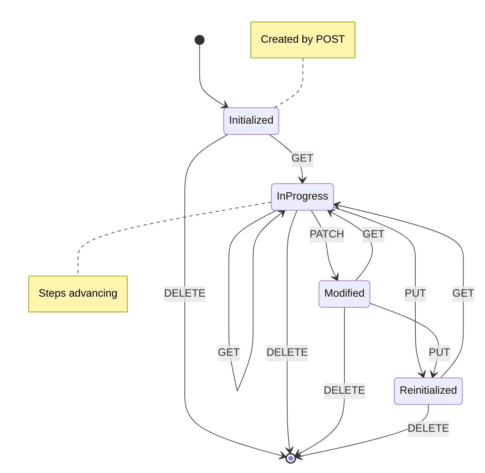
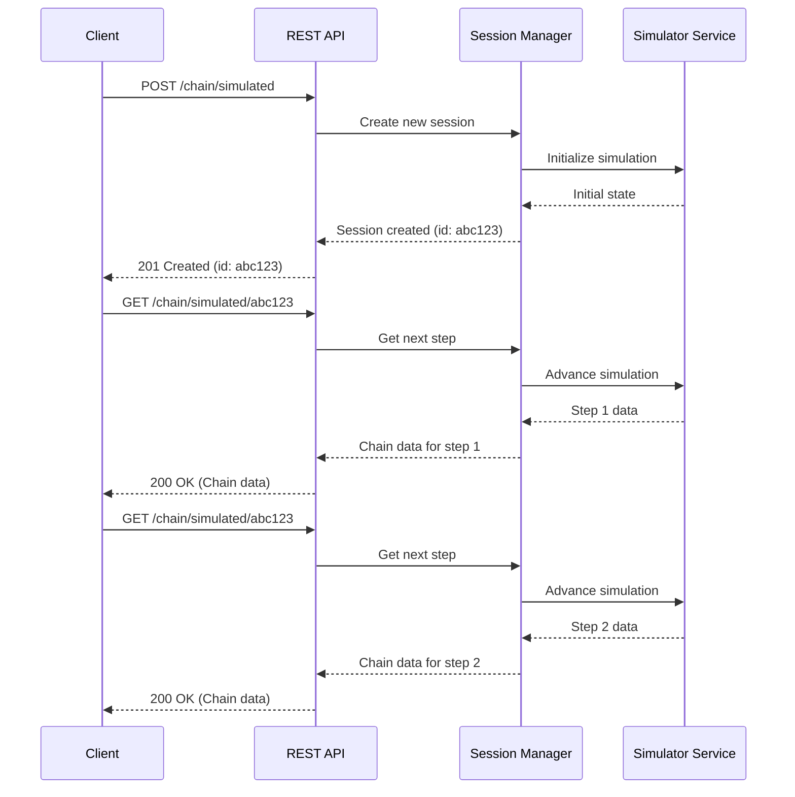
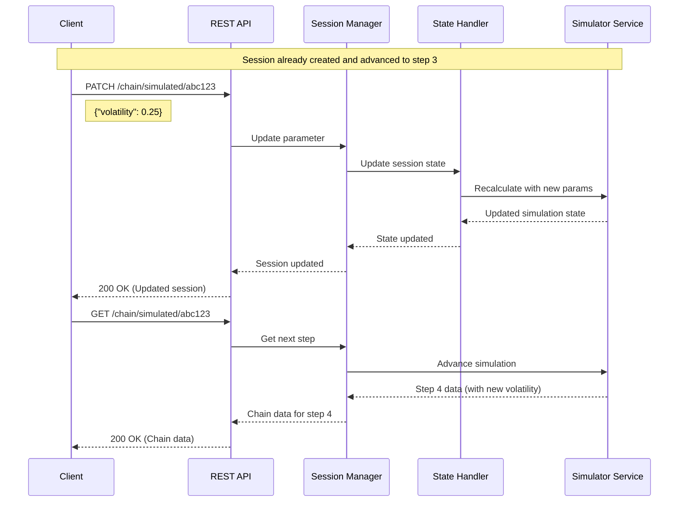
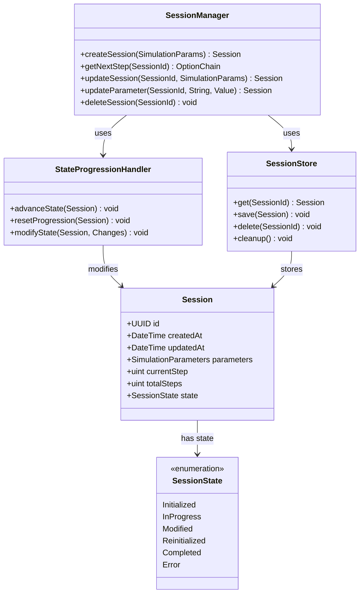

# Session Management in OptionChain-Simulator

This document details the session management subsystem of the OptionChain-Simulator, explaining how client requests are handled across multiple interactions to maintain state for ongoing simulations.

## Overview

The Session Management layer is a core component of the OptionChain-Simulator architecture that enables stateful interactions with simulations. It allows clients to:

- Create and configure simulation sessions
- Advance through simulation steps progressively
- Modify simulation parameters mid-session
- Properly clean up resources when sessions are no longer needed

## Session State Model

A simulation session progresses through several states during its lifecycle:



## HTTP Method Mapping

The system uses HTTP methods semantically to manage the session lifecycle:

| HTTP Method | Endpoint | Action | Description |
|-------------|----------|--------|-------------|
| POST | `/chain/simulated` | Create Session | Creates a new simulation session with initial parameters and prepares all steps |
| GET | `/chain/simulated/{session_id}` | Read Next Step | Advances the simulation by one step and returns the new chain data |
| PUT | `/chain/simulated/{session_id}` | Replace Session | Completely replaces simulation parameters, potentially resetting simulation |
| PATCH | `/chain/simulated/{session_id}` | Update Parameters | Modifies specific parameters while preserving others and the current state |
| DELETE | `/chain/simulated/{session_id}` | Terminate Session | Removes the session and frees associated resources |

## Session Flow Examples

### Example 1: Basic Simulation Progression



### Example 2: Parameter Modification Mid-Simulation



## Session Components

The session management layer consists of the following components:



## Implementation Details

### Session Identifier

Each session is assigned a unique UUID v4 identifier upon creation. This identifier is used in all subsequent requests to refer to the specific simulation instance.

### Session Storage

Sessions are stored in-memory with optional persistence to a backing store for recovery in case of service restart. The storage implementation follows the Repository pattern, allowing for different storage backends:

- In-memory (default for development)
- Redis (recommended for production)
- PostgreSQL (for environments needing stronger persistence)

### Session Lifecycle Management

Sessions have a configurable time-to-live (TTL) to prevent resource leaks:

1. A session is considered **active** when it has been accessed within the TTL period
2. Idle sessions exceeding the TTL are automatically cleaned up by a background job
3. The default TTL is 30 minutes, configurable via the application settings

### Concurrency Control

To prevent race conditions with concurrent modifications:

1. Each session has an optimistic locking mechanism using a version counter
2. Update operations must provide the current version to succeed
3. If a version mismatch is detected, the operation fails with a 409 Conflict response

## REST API Interface

### Session Creation (POST)

**Request:**
```http
POST /chain/simulated HTTP/1.1
Content-Type: application/json

{
  "initialPrice": 100.0,
  "volatility": 0.2,
  "riskFreeRate": 0.03,
  "strikes": [90, 95, 100, 105, 110],
  "expirations": ["2023-06-30", "2023-07-31"],
  "method": "GeometricBrownian"
}
```

**Response:**
```http
HTTP/1.1 201 Created
Content-Type: application/json
Location: /chain/simulated/f47ac10b-58cc-4372-a567-0e02b2c3d479

{
  "id": "f47ac10b-58cc-4372-a567-0e02b2c3d479",
  "createdAt": "2023-04-15T14:30:00Z",
  "parameters": {
    "initialPrice": 100.0,
    "volatility": 0.2,
    "riskFreeRate": 0.03,
    "strikes": [90, 95, 100, 105, 110],
    "expirations": ["2023-06-30", "2023-07-31"],
    "method": "GeometricBrownian"
  },
  "currentStep": 0,
  "totalSteps": 20,
  "state": "Initialized"
}
```

### Get Next Step (GET)

**Request:**
```http
GET /chain/simulated/f47ac10b-58cc-4372-a567-0e02b2c3d479 HTTP/1.1
```

**Response:**
```http
HTTP/1.1 200 OK
Content-Type: application/json

{
  "underlying": "SIMULATION",
  "timestamp": "2023-04-15T14:35:00Z",
  "price": 101.23,
  "contracts": [
    {
      "type": "Call",
      "strike": 100.0,
      "expiration": "2023-06-30",
      "price": 5.67,
      "delta": 0.58,
      "gamma": 0.04,
      "theta": -0.03,
      "vega": 0.25
    },
    // Additional contracts...
  ],
  "sessionInfo": {
    "id": "f47ac10b-58cc-4372-a567-0e02b2c3d479",
    "currentStep": 1,
    "totalSteps": 20
  }
}
```

### Update Parameter (PATCH)

**Request:**
```http
PATCH /chain/simulated/f47ac10b-58cc-4372-a567-0e02b2c3d479 HTTP/1.1
Content-Type: application/json

{
  "volatility": 0.25
}
```

**Response:**
```http
HTTP/1.1 200 OK
Content-Type: application/json

{
  "id": "f47ac10b-58cc-4372-a567-0e02b2c3d479",
  "updatedAt": "2023-04-15T14:45:00Z",
  "parameters": {
    "initialPrice": 100.0,
    "volatility": 0.25,  // Updated value
    "riskFreeRate": 0.03,
    "strikes": [90, 95, 100, 105, 110],
    "expirations": ["2023-06-30", "2023-07-31"],
    "method": "GeometricBrownian"
  },
  "currentStep": 5,
  "totalSteps": 20,
  "state": "Modified"
}
```

## Best Practices

### Client Implementation

Clients should:

1. Store the session ID returned from the initial POST request
2. Use sequential GET requests to advance through the simulation
3. Handle HTTP 410 Gone errors if a session expires or is deleted
4. Explicitly DELETE sessions when done to free resources immediately
5. Include appropriate error handling for failed state transitions

### Server-Side Considerations

The implementation should:

1. Apply appropriate rate limiting to prevent resource exhaustion
2. Include detailed logging of session state transitions for debugging
3. Implement proper error handling with clear client feedback
4. Use background tasks for cleanup of expired sessions
5. Consider distributed session storage for high-availability deployments