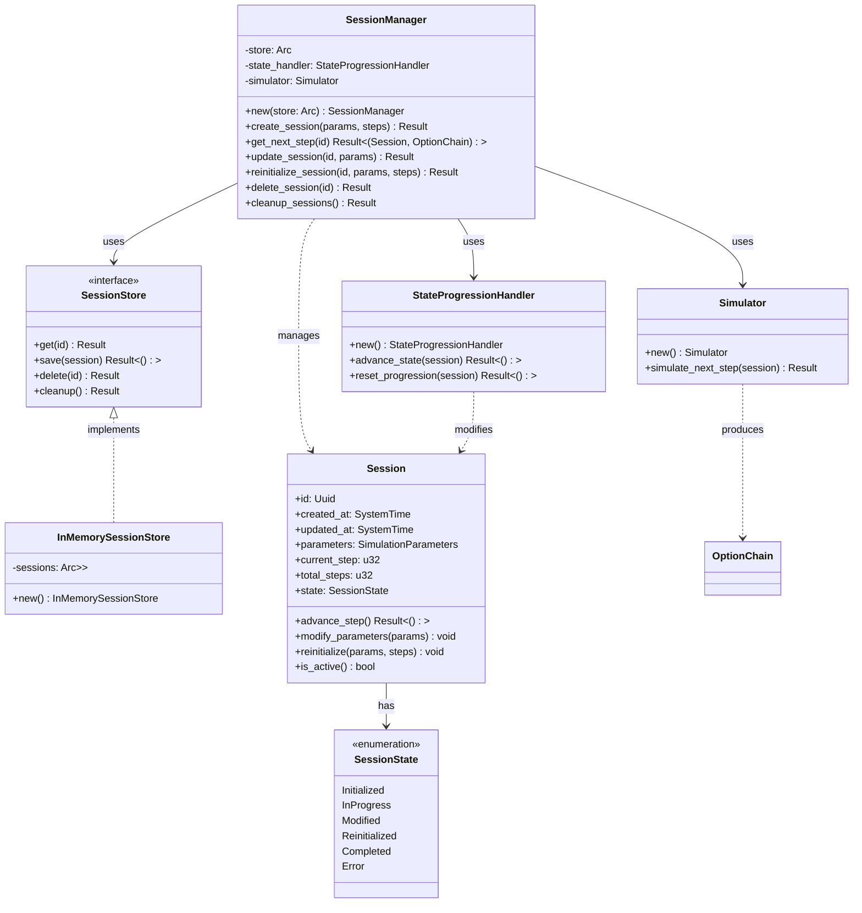

```mermaid
classDiagram
    class SessionManager {
        -store: Arc<dyn SessionStore>
        -state_handler: StateProgressionHandler
        -simulator: Simulator
        +new(store: Arc<dyn SessionStore>) SessionManager
        +create_session(params, steps) Result<Session>
        +get_next_step(id) Result<(Session, OptionChain)>
        +update_session(id, params) Result<Session>
        +reinitialize_session(id, params, steps) Result<Session>
        +delete_session(id) Result<bool>
        +cleanup_sessions() Result<usize>
    }
    
    class SessionStore {
        <<interface>>
        +get(id) Result<Session>
        +save(session) Result<()>
        +delete(id) Result<bool>
        +cleanup() Result<usize>
    }
    
    class InMemorySessionStore {
        -sessions: Arc<Mutex<HashMap<Uuid, Session>>>
        +new() InMemorySessionStore
    }
    
    class StateProgressionHandler {
        +new() StateProgressionHandler
        +advance_state(session) Result<()>
        +reset_progression(session) Result<()>
    }
    
    class Session {
        +id: Uuid
        +created_at: SystemTime
        +updated_at: SystemTime
        +parameters: SimulationParameters
        +current_step: u32
        +total_steps: u32
        +state: SessionState
        +advance_step() Result<()>
        +modify_parameters(params) void
        +reinitialize(params, steps) void
        +is_active() bool
    }
    
    class SessionState {
        <<enumeration>>
        Initialized
        InProgress
        Modified
        Reinitialized
        Completed
        Error
    }
    
    class Simulator {
        +new() Simulator
        +simulate_next_step(session) Result<OptionChain>
    }
    
    SessionManager --> SessionStore: uses
    SessionManager --> StateProgressionHandler: uses
    SessionManager --> Simulator: uses
    SessionStore <|.. InMemorySessionStore: implements
    SessionManager ..> Session: manages
    Session --> SessionState: has
    StateProgressionHandler ..> Session: modifies
    Simulator ..> OptionChain: produces
```