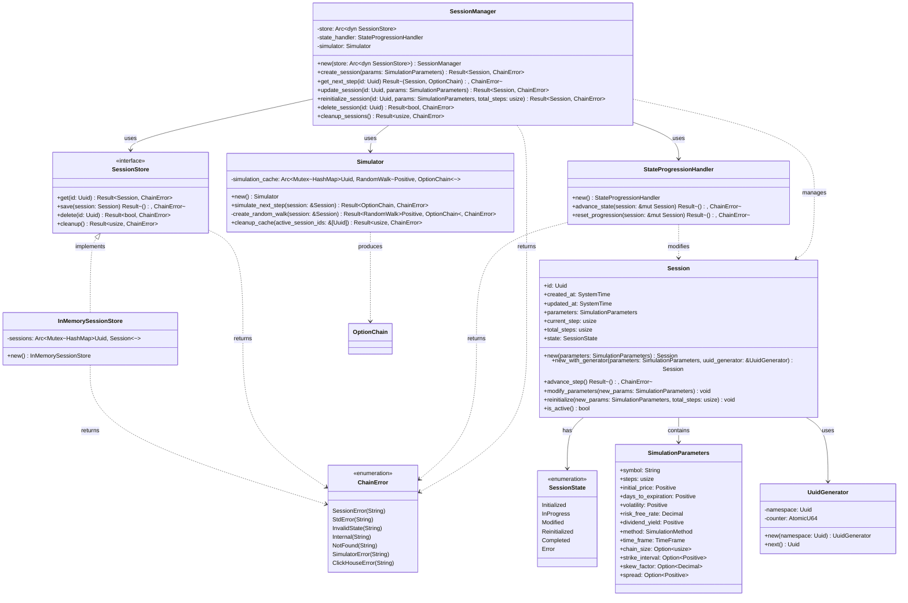

```mermaid
classDiagram
    class SessionManager {
        -store: Arc~dyn SessionStore~
        -state_handler: StateProgressionHandler
        -simulator: Simulator
        +new(store: Arc~dyn SessionStore~) SessionManager
        +create_session(params: SimulationParameters) Result~Session, ChainError~
        +get_next_step(id: Uuid) Result~(Session, OptionChain), ChainError~
        +update_session(id: Uuid, params: SimulationParameters) Result~Session, ChainError~
        +reinitialize_session(id: Uuid, params: SimulationParameters, total_steps: usize) Result~Session, ChainError~
        +delete_session(id: Uuid) Result~bool, ChainError~
        +cleanup_sessions() Result~usize, ChainError~
    }
    
    class SessionStore {
        <<interface>>
        +get(id: Uuid) Result~Session, ChainError~
        +save(session: Session) Result~(), ChainError~
        +delete(id: Uuid) Result~bool, ChainError~
        +cleanup() Result~usize, ChainError~
    }
    
    class InMemorySessionStore {
        -sessions: Arc~Mutex~HashMap~Uuid, Session~~~
        +new() InMemorySessionStore
    }
    
    class StateProgressionHandler {
        +new() StateProgressionHandler
        +advance_state(session: &mut Session) Result~(), ChainError~
        +reset_progression(session: &mut Session) Result~(), ChainError~
    }
    
    class Session {
        +id: Uuid
        +created_at: SystemTime
        +updated_at: SystemTime
        +parameters: SimulationParameters
        +current_step: usize
        +total_steps: usize
        +state: SessionState
        +new(parameters: SimulationParameters) Session
        +new_with_generator(parameters: SimulationParameters, uuid_generator: &UuidGenerator) Session
        +advance_step() Result~(), ChainError~
        +modify_parameters(new_params: SimulationParameters) void
        +reinitialize(new_params: SimulationParameters, total_steps: usize) void
        +is_active() bool
    }
    
    class SimulationParameters {
        +symbol: String
        +steps: usize
        +initial_price: Positive
        +days_to_expiration: Positive
        +volatility: Positive
        +risk_free_rate: Decimal
        +dividend_yield: Positive
        +method: SimulationMethod
        +time_frame: TimeFrame
        +chain_size: Option~usize~
        +strike_interval: Option~Positive~
        +skew_factor: Option~Decimal~
        +spread: Option~Positive~
    }
    
    class SessionState {
        <<enumeration>>
        Initialized
        InProgress
        Modified
        Reinitialized
        Completed
        Error
    }
    
    class UuidGenerator {
        -namespace: Uuid
        -counter: AtomicU64
        +new(namespace: Uuid) UuidGenerator
        +next() Uuid
    }
    
    class Simulator {
        -simulation_cache: Arc~Mutex~HashMap~Uuid, RandomWalk~Positive, OptionChain~~~
        +new() Simulator
        +simulate_next_step(session: &Session) Result~OptionChain, ChainError~
        -create_random_walk(session: &Session) Result~RandomWalk~Positive, OptionChain~, ChainError~
        +cleanup_cache(active_session_ids: &[Uuid]) Result~usize, ChainError~
    }
    
    class ChainError {
        <<enumeration>>
        SessionError(String)
        StdError(String)
        InvalidState(String)
        Internal(String)
        NotFound(String)
        SimulatorError(String)
        ClickHouseError(String)
    }
    
    SessionManager --> SessionStore: uses
    SessionManager --> StateProgressionHandler: uses
    SessionManager --> Simulator: uses
    SessionStore <|.. InMemorySessionStore: implements
    SessionManager ..> Session: manages
    SessionManager ..> ChainError: returns
    Session --> SessionState: has
    Session --> SimulationParameters: contains
    Session --> UuidGenerator: uses
    StateProgressionHandler ..> Session: modifies
    StateProgressionHandler ..> ChainError: returns
    Simulator ..> OptionChain: produces
    SessionStore ..> ChainError: returns
    InMemorySessionStore ..> ChainError: returns
```