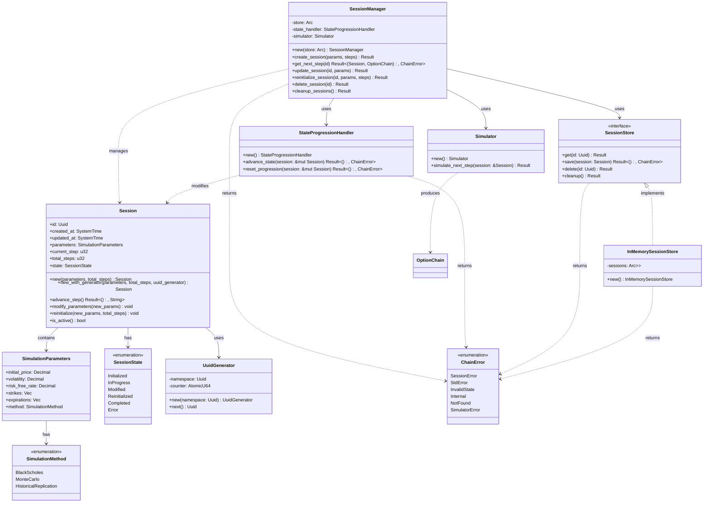

```mermaid
classDiagram
    class SessionManager {
        -store: Arc<dyn SessionStore>
        -state_handler: StateProgressionHandler
        -simulator: Simulator
        +new(store: Arc<dyn SessionStore>) SessionManager
        +create_session(params, steps) Result<Session, ChainError>
        +get_next_step(id) Result<(Session, OptionChain), ChainError>
        +update_session(id, params) Result<Session, ChainError>
        +reinitialize_session(id, params, steps) Result<Session, ChainError>
        +delete_session(id) Result<bool, ChainError>
        +cleanup_sessions() Result<usize, ChainError>
    }
    
    class SessionStore {
        <<interface>>
        +get(id: Uuid) Result<Session, ChainError>
        +save(session: Session) Result<(), ChainError>
        +delete(id: Uuid) Result<bool, ChainError>
        +cleanup() Result<usize, ChainError>
    }
    
    class InMemorySessionStore {
        -sessions: Arc<Mutex<HashMap<Uuid, Session>>>
        +new() InMemorySessionStore
    }
    
    class StateProgressionHandler {
        +new() StateProgressionHandler
        +advance_state(session: &mut Session) Result<(), ChainError>
        +reset_progression(session: &mut Session) Result<(), ChainError>
    }
    
    class Session {
        +id: Uuid
        +created_at: SystemTime
        +updated_at: SystemTime
        +parameters: SimulationParameters
        +current_step: u32
        +total_steps: u32
        +state: SessionState
        +new(parameters, total_steps) Session
        +new_with_generator(parameters, total_steps, uuid_generator) Session
        +advance_step() Result<(), String>
        +modify_parameters(new_params) void
        +reinitialize(new_params, total_steps) void
        +is_active() bool
    }
    
    class SimulationParameters {
        +initial_price: Decimal
        +volatility: Decimal
        +risk_free_rate: Decimal
        +strikes: Vec<Decimal>
        +expirations: Vec<Duration>
        +method: SimulationMethod
    }
    
    class SessionState {
        <<enumeration>>
        Initialized
        InProgress
        Modified
        Reinitialized
        Completed
        Error
    }
    
    class SimulationMethod {
        <<enumeration>>
        BlackScholes
        MonteCarlo
        HistoricalReplication
    }
    
    class UuidGenerator {
        -namespace: Uuid
        -counter: AtomicU64
        +new(namespace: Uuid) UuidGenerator
        +next() Uuid
    }
    
    class Simulator {
        +new() Simulator
        +simulate_next_step(session: &Session) Result<OptionChain, String>
    }
    
    class ChainError {
        <<enumeration>>
        SessionError
        StdError
        InvalidState
        Internal
        NotFound
        SimulatorError
    }
    
    SessionManager --> SessionStore: uses
    SessionManager --> StateProgressionHandler: uses
    SessionManager --> Simulator: uses
    SessionStore <|.. InMemorySessionStore: implements
    SessionManager ..> Session: manages
    SessionManager ..> ChainError: returns
    Session --> SessionState: has
    Session --> SimulationParameters: contains
    Session --> UuidGenerator: uses
    SimulationParameters --> SimulationMethod: has
    StateProgressionHandler ..> Session: modifies
    StateProgressionHandler ..> ChainError: returns
    Simulator ..> OptionChain: produces
    SessionStore ..> ChainError: returns
    InMemorySessionStore ..> ChainError: returns
```